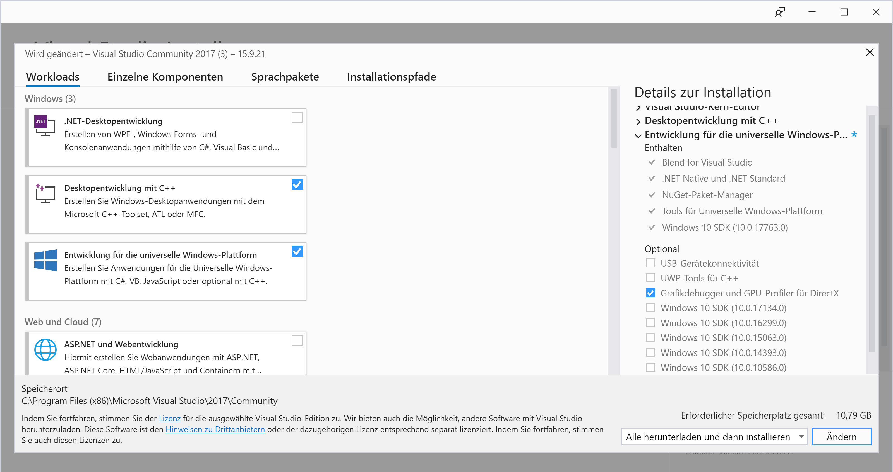
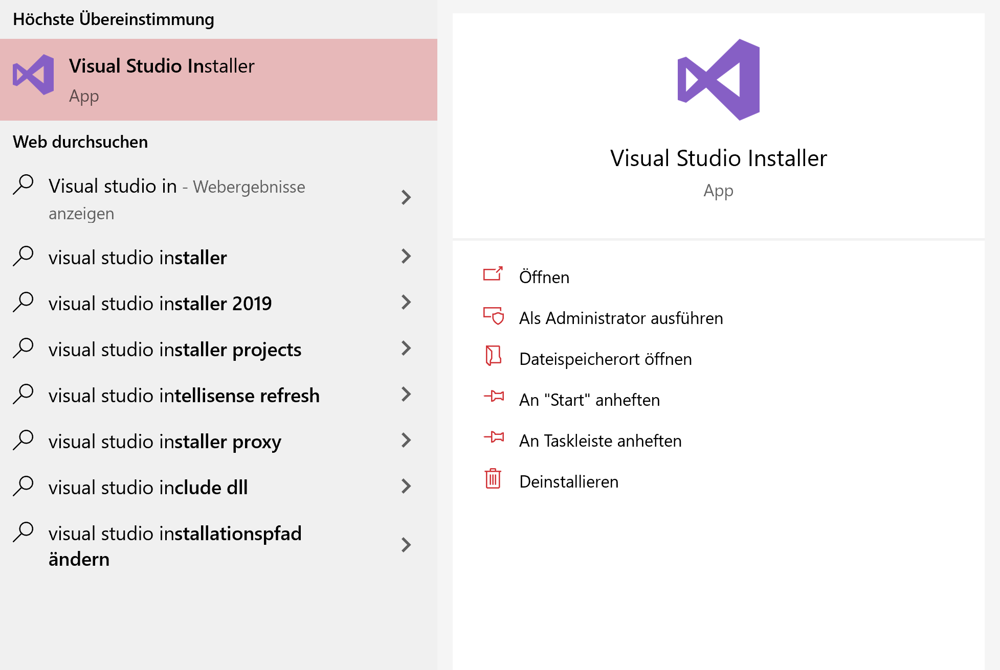
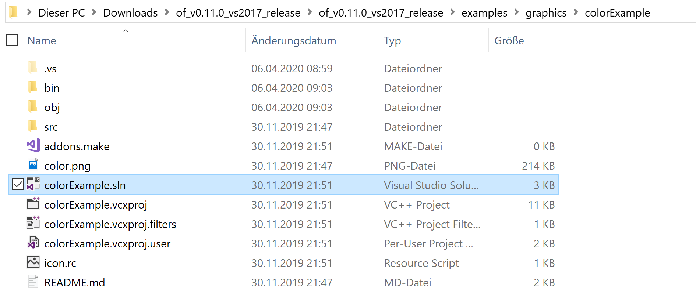
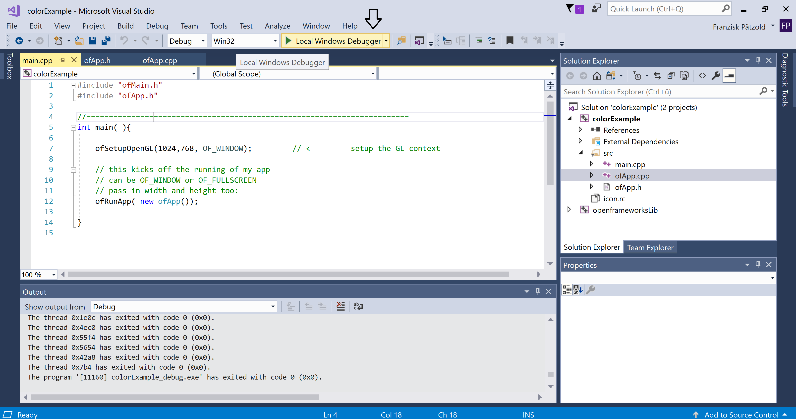
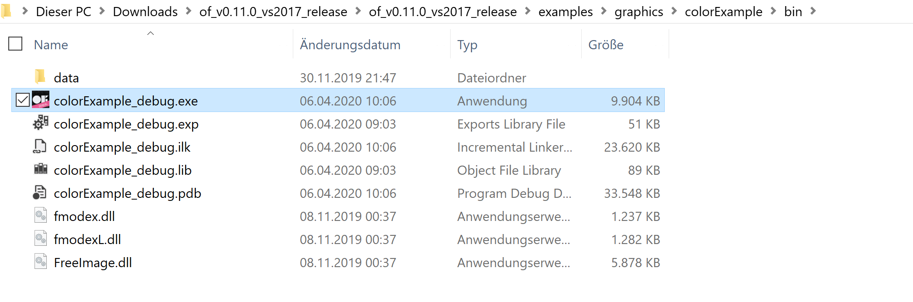
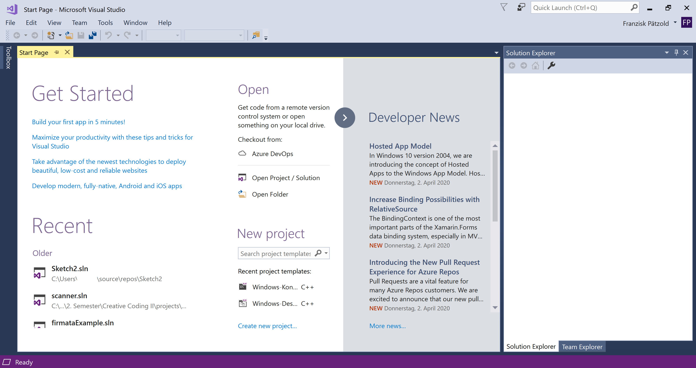
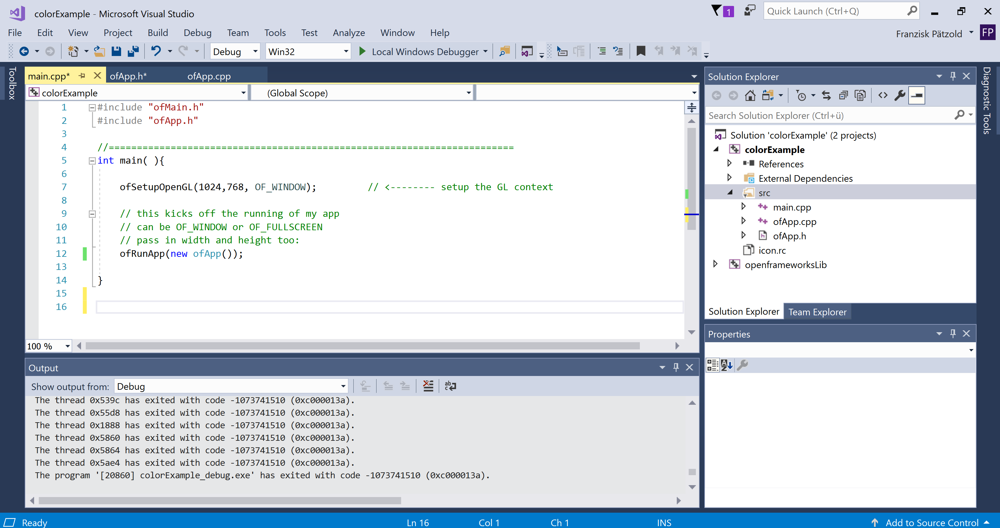

<!-- ---  
title: Creative Coding II
author: Franziska Pätzold
affiliation: Film University Babelsberg KONRAD WOLF
date: Summer term 20
---   -->

Franziska Pätzold | franziska.paetzold@filmuniversitaet.de | Film University Babelsberg *KONRAD WOLF*

# Visual Studio Community Hints

Hi. You are one of the lucky (probably) Windows and Visual Studio Community users. The following hints are referring to Visual Studio Community 2017.

If you run into problems while installation or a new project setup, please don't give up on C++ in general. Feel always free to to contact us if something is not clear to you - or you have suggestions to add to the topics.

Have fun!

---

**Table of Contents**
- [Visual Studio Community Hints](#visual-studio-community-hints)
  - [Before Getting Started](#before-getting-started)
  - [How To Start A Solution File](#how-to-start-a-solution-file)
  - [The Visual Studio Community UI](#the-visual-studio-community-ui)
  - [Hints for creating new projects](#hints-for-creating-new-projects)

---

## Before Getting Started

Please make sure you have the following software packages installed during the installation of Visual Studio Community. 



You can either check it or catch the installation up by making use of the Visual Studio Installer:



## How To Start A Solution File

After you downloaded the  [openFrameworks for Visual Studio package](https://openframeworks.cc/download/), please unpack the downloaded file. 

[](https://openframeworks.cc/download/)

Now you are able to browse through openFrameworks example projects. You can find them under your_oF_download>examples. Choose one of the examples, double click the solution file (.sln) and open it with Visual Studio.



Just press the green arrow/Local Windows Debugger to run the project.



At this point, the application should have started. Also, that process created you an executable file (.exe) in the projects bin folder. 




## The Visual Studio Community UI

So. Here we are. That's the UI you should see after starting the program. You can open projects under the "File" tab. Or the way that's described above. 



After you opened a project or you created a new one your Visual Studio looks like this:



- On the upper left, you have your current opened classes. If there is a star behind the file files name (like ofApp.h*) it means you have unsaved changes. Please make sure, you save your changes before you start a new build. 

- On the upper right, you can find the Solution Explorer. Here you have your folder structure. It makes you easier to navigate through your project files.

- On the lower left, you find the Output window.  It shows you either the current status of your project or your build failed (e.g. like ========== Build: 0 succeeded, 1 failed, 1 up-to-date, 0 skipped ==========), then please find under that window a new window Error list: here you can find your helpful error messages.

- On the lower right you can find the Properties window, I closed it - because I never used it. 

## Hints for creating new projects

```diff
- Please note: The creation of new projects will be discussed in detail in session 02. 
```

Some mistakes are made very often in the beginning, so here are some hints for a better start.

1. Make use of Visual Studios tools. E.g. create new classes with Project > Add Class... . It will create you connected header and definition files. This way you also make sure, that you don't forget #pragmaonce or the last comma in the header file or, or, or...

2. If you made some changes, but don't see them in your lastest build or the error message will not change, please make sure you saved all of your classes manually after you made some changes - if you didn't build your project like described here, it could have happened that you found a way where the files weren't saved automatically. 

3. If you get errors, that don't make sense to you, it's worth it to run the project generator (your_oF_download > projectGenerator-vs > projectgenerator.exe) with your project and start the build again. In this case, it could have happened that you made use of packages like ofGUI. The project generator sets the paths correctly to these packages. 