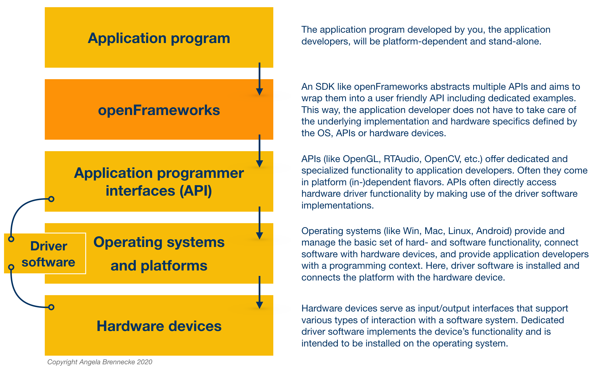

<!-- ---  
title: Creative Coding II
author: Angela Brennecke
affiliation: Film University Babelsberg KONRAD WOLF
date: Summer term 20
---   -->
**Creative Coding II - Summerterm 20**

Prof. Dr. Angela Brennecke | a.brennecke@filmuniversitaet.de | Film University Babelsberg *KONRAD WOLF*

---

**Table of Contents**
- [Learning Objectives](#learning-objectives)
- [What is openFrameworks?](#what-is-openframeworks)
  - [openFrameworks and Processing](#openframeworks-and-processing)
  - [Platform-Dependent Development](#platform-dependent-development)
  - [Software Interfaces, APIs, and SDKs](#software-interfaces-apis-and-sdks)
  - [openFrameworks SDK](#openframeworks-sdk)
  - [openFrameworks Addons](#openframeworks-addons)
- [Setup and Installation](#setup-and-installation)
  - [openFrameworks](#openframeworks)
  - [Integrated Development Environment](#integrated-development-environment)
    - [macOS and XCode](#macos-and-xcode)
    - [Windows and Visual Studio](#windows-and-visual-studio)
- [Building a First ofExample](#building-a-first-ofexample)
  - [The C++ Build Process](#the-c-build-process)
      - [Advanced Side Notes](#advanced-side-notes)
    - [Compiler and Linker Errors](#compiler-and-linker-errors)
- [Reading Material](#reading-material)

---

# Learning Objectives

- Getting an overview of openFrameworks
- Setting up an integrated development environment
- Building a first openFrameworks app
- Getting a first impression of C++ syntax

# What is openFrameworks?

[openFrameworks](https://openframeworks.cc) is free, open source C++ software development kit (SDK) that takes a development approach similar to the Processing environment. Interestingly, both toolkits [originate from the Massachusetts Institute of Technology (MIT)](https://openframeworks.cc/ofBook/chapters/foreword.html). The openFrameworks SDK targets easy development of **real-time** and **close-to-the-hardware applications** and is primarily designed for use in creative and experimental projects. It is cross-platform and supports systems such as OS X, Windows, Linux, iOS, Android & Linux ARM devices such as Raspberry Pi. 

## openFrameworks and Processing

openFrameworks does not come with an integrated development environment right away like Processing does. Instead, openFrameworks comes with a set of **C++ source files** (comprised of header *.h and definition *.cpp files) and system-dependent **pre-compiled libraries** (file extensions *.a on macOS, *.lib on Windows) among other files. These have to be processed as part of a compilation and build process which results in an  openFrameworks application. The resulting application **binary or executable** can be launched by the operating system (OS) as a standalone application and runs independently from the development environment. 

Processing, in contrast, is implemented in Java and thus builds on the Java Virtual Machine. Consequently the resulting application sketch requires the Processing IDE for launching and running the sketch. This can be more convenient in many cases but has its limitations when it comes to real-time applications and time consuming computations in general. Since recently Processing sketches can be exported as standalone applications, too. 

## Platform-Dependent Development

To build an openFrameworks/C++ application, an independent **integrated development environment** (IDE) is required. Such an IDE is used 
- to **compile** and **link** the source files in order 
- to **build** the application (file extensions *.app on macOS, *.exe on Windows).   

openFrameworks applications can be build with [several IDEs](https://openframeworks.cc/download/), some of them are platform-dependent, i.e., they will execute on one platform only like XCode and Visual Studio. Some of them are cross-platform, i.e., they will execute on multiple platforms like Qt Creator. In both cases, the IDE will build a platform-dependent application, often referred to as **native application**. This application will run on a macOS computer if it was build there but will not run on a Windows computer and vice versa. Platform-dependent IDEs are usually optimized for a specific platform whereas cross-platform IDEs require additional configuration settings in order to build applications for a specific platform. In this course, we will use two platform-dependent IDES,  **XCode** on macOS and **MS Visual Studio Community 2017** on Windows. Both of them are well documented and supported in the openFrameworks community.

An advantage of the **platform-dependent** or **native development** with C++ is the ability to create applications that can apply the platform's software and hardware resources directly. macOS and Apple computers come with different implementations for how to use and connect with the operating system and hardware devices than do Microsoft and Windows computers. The same is true for Linux as well as any of the embedded systems. 

Even though a development environment like Processing works for both, macOS and Windows platforms, too, there is by default no support inside of Processing for an advanced access, use and manipulation of platform resources. The development is primarily limited by what the Processing IDE supports.

## Software Interfaces, APIs, and SDKs

In the context of platform-dependent development with openFrameworks, it will be helpful to develop an understanding of the following terms:

* The term **software interface** is a general description for how software programs can interact and communicate with each other, exchange data or execute functions. 

* The term **application programming interface** (API) is a formal description of a software interface. It is used to specify a certain part of an application program that allows other programs to connect with it.

* The term **software development kit** (SDK) describes a set of software interaces as well as additional development tools that support application programmers to develop and implement a software application. Additional development tools might, for example, be APIs, documentation, example code, precompiled libraries, scripts or executables. 

## openFrameworks SDK

The following diagram illustrates the different soft- and hardware layers and their relationships in the context of openFrameworks. The blue connection points can be considered software interfaces:

Imagine you would like to implement an application that allows you to record incoming audio from your soundcard. On macOS you could use functionality provided by [Core Audio](https://developer.apple.com/library/archive/documentation/MusicAudio/Conceptual/CoreAudioOverview/Introduction/Introduction.html#//apple_ref/doc/uid/TP40003577-CH1-SW1) which represents the standard macOS software interfaces for audio development. On Windows platforms different software interfaces exist that allow you to implement how your application connects with soundcards and audio interfaces. Here you could use functionality provided by **Directsound** or **WASAPI** (Windows Audio Session API) which are part of the [Windows Core Audio APIs](https://docs.microsoft.com/en-us/windows/win32/coreaudio/core-audio-apis-in-windows-vista). The same applies for other devices like graphics cards, webcams as well as certain functionality handled by the operating system.

Since it can be rather tedious for an application developer to take care of all of the individual APIs themselves, certain software development kits package multiple APIs and useful functionality into a uniform set of functions. openFrameworks does exactly that. It takes care of creating a graphical window, listening for mouse and keyboard events, processes incoming and outgoing audio streams, 3d graphics, image and video processing, and many more. This way, developers can start with expressing their ideas fairly quickly and at the same time work with an optimal connection to their hardware resources. 

## openFrameworks Addons

openFrameworks is also highly extensible and provides a dedicated mechanism to involve additional functionality through the use of [ofxAddons](https://ofxaddons.com/categories). These are usually open source and add specific or custom functionality to the SDK. Addons are generally built and maintained by members of the openFrameworks community. The downside here is that not all of the addons are maintained continuously. Hence, several addons are outdated and no longer compatible with the latest openFrameworks version. Once you understand how C++ and openFrameworks work, you can workaround this and update an outdated ofxAddon yourselves ;-)

# Setup and Installation

In order to build your own openFrameworks applications, you will need to download the openFrameworks SDK as well as an IDE for your platform. Follow the description below. If you have questions and problems during the installation, make use of the [openFrameworks forum](ttps://forum.openframeworks.cc) which contains lots of useful hints and discussions.

## openFrameworks 
Download the latest version of openFrameworks for the platform you will be working on, i.e., macOS and Windows, from this website https://openframeworks.cc/download/: 
- "download openFrameworks for osx"
- "download openFrameworks for visual studio (2017)"

Once you have downloaded openFrameworks, extract the zip file to a folder location from where you would like to work. You do not have to install anything in order to work with the SDK except for an IDE. Further documentation on the technical requirements and environment setup is available in these files

- of\_root\_folder/README.md
- of\_root\_folder/INSTALL.md
- of\_root\_folder/docs/

Checkout this introduction video on the openFrameworks SDK and its folder structure:

## Integrated Development Environment

In this course, we will use **XCode** for macOS and **MS Visual Studio Community 2017** ("Visual Studio" or simply "vs") for Windows platforms. 

Central features of the IDEs are:
1. A **text editor** usually with syntax highlighting.
2. A **debugger** to step through the code during runtime and in order to identify mistakes and bugs.
3. A **build environment** that processes, compiles, and links the source code.

The IDEs feature more than that, for instance, they support version control, deployment facilities or additional code optimization tools. 

*Note: As mentioned earlier, other IDEs and platforms will work with openFrameworks as well but will require you to take care of the setup and processing yourselves. Visual Studio Code is a very good alternative that works on both platforms, macOS and Windows. However, at the moment it is [not possible to use the latest debugger on macOS Catalina with Visual Studio Code](https://github.com/microsoft/vscode-cpptools/issues/3829).*

### macOS and XCode
If you are working on **macOS**, you will need to download and install **Xcode**.  
- Follow the instructions here https://openframeworks.cc/setup/xcode/. 
- Checkout [this video to get a first impression of how to work with openFrameworks on MacOSX](https://www.youtube.com/watch?v=rplUouqg8mc)

### Windows and Visual Studio

If you are working on Windows, you will need to install **MS Visual Studio Community 2017**.   
- Follow the instructions here https://openframeworks.cc/setup/vs/. 
- Checkout [this video to get a first impression of how to work with openFrameworks on Windows](https://www.youtube.com/watch?v=DtD007zeztA)

# Building a First ofExample

Once you have installed the IDE on your platform and unpacked the downloaded openFrameworks SDK to a folder of your liking you can start building the example applications that come with openFrameworks. 

It is important to understand that you have to build the example applications with the help of the IDE. To do so, **double-click the project files** which will in turn launch the corresponding IDE:

- *.**xcodeproject** for XCode  
- *.**sln** for Visual Studio

The project files contain all of the necessary information required to build an application. They heavily rely on the openFrameworks folder structure because they search the folders for all of the necessary files and information required to compile, link, and build the application. Any change to the folder structure should therefore be considered carefully as it might break the build process. Once you have opened the project file in the IDE, trigger the build process.

Check out this video for an overview:

## The C++ Build Process

The C++ build process is a complex sequential execution of different steps  that turn **source code** into **native software programs**. These programs, also referred to as **executables** or **binaries**, can then be launched and run on the operating system. The executables are platform-dependent as is clearly defined by their file extension, for example

- myApp.**app** on macOS 
- myApp.**exe** on Windows.  

Before any build process can be executed, however, source code has to be written. The following diagram illustrates the overall C++ development process including the build process:

  
*Image credit: Richard L. Halterman (2017): Fundamentals of C++ Programming. Online print.*

**Editing**

- The software developer conceives a solution for a given problem and designs a software with the help of a code editor.
- The developer is responsible for including and adding additional sources and functionality if required, for instance, in the form of  additional APIs.
- When ready, the developer triggers the build process in the IDE.

**Preprocessing**

- The preprocesser analyses the source code and evaluates specific preprocessor directives like **#inlcude**. These routines inform the compiler and linker about including additional libraries, for instance, for the APIs our programs will use.
- Based on the evaluation, the source code may be enhanced and modified so that it is prepared for the actual compilation.

**Compilation** 

- The compiler translates the enhanced C++ source code into **object code**. Object code is a specific type of machine code (composed of bits) that contains additional meta data required by the linking step.

**Linking**

- The linker picks up all object code and pre-compiled library code that is required to build the final application and generates the executable.
- The executable is now written in **native machine code** and can be launched and exectuted by the operating system.

***NOTE**: In the context of triggering a build and thus executing the compilation,  in your IDE you might find the term **target**. This refers to the platform for which the compilation is going to generate machine code for.*

#### Advanced Side Notes
Executables are sets of instructions that tell the computer how to operate. Therefore, the instructions have to be written in machine code. Machine code is a very low-level programming language with each instruction set being composed of bits like, for example, "10110000 01100001". These instruction sets are different per platform and in particular per CPU.

Each platform's operating system comes with a small program called **loader**. When executing the binary, i.e., by double-clicking it, the loader loads the binary file into the platform's random access memory (RAM) and the platform's CPU executes the machine code instructions.

### Compiler and Linker Errors

During the build process, the IDE evaluates the source code, object code and final machine code continuously. If an expression, statement or definition cannot be successfully processed, the IDE will stop the build process and throw an **compile-time error**. Such an error is usually triggered during the compilation or the linking step of the build process. 

- **Compiler errors** occur during compilation usually refer to syntax errors in the source code. The IDE provides you with *compiler error code* which is usually very helpful to identify and fix the compiler error. Nonetheless, it takes a while until you will get used to reading it.

- **Linker errors** occur during linking of the object files and are often much harder to fix. These types of errors usually occur when certain implementation details are missing during linking. Again, the IDE provides you with *linker error code* but it will take a while to get familiar with it. Most prominent issues are
  - A function has only been declared not defined.
  - An additional library has been linked but cannot be found by the linker (i.e., because the folder structure has changed or the library has been removed).

# Reading Material

- Checkout the [ofBook](https://openframeworks.cc/ofBook)
  - Recap the [openFrameworks folder structure](https://openframeworks.cc/ofBook/chapters/setup_and_project_structure.html)
  - Read the chapter on [C++ basics](https://openframeworks.cc/ofBook/chapters/cplusplus_basics.html) 

- Checkout [cpplearn](https://wwww.learncpp.com)
  - Recap [the build process](https://www.learncpp.com/cpp-tutorial/introduction-to-the-compiler-linker-and-libraries/)
  - Skim through [Chapters 1 and 2](https://www.learncpp.com) to get an understanding of C++ syntax and checkout sections 1.1 to 1.4 and 2.1 to 2.3 in particular.