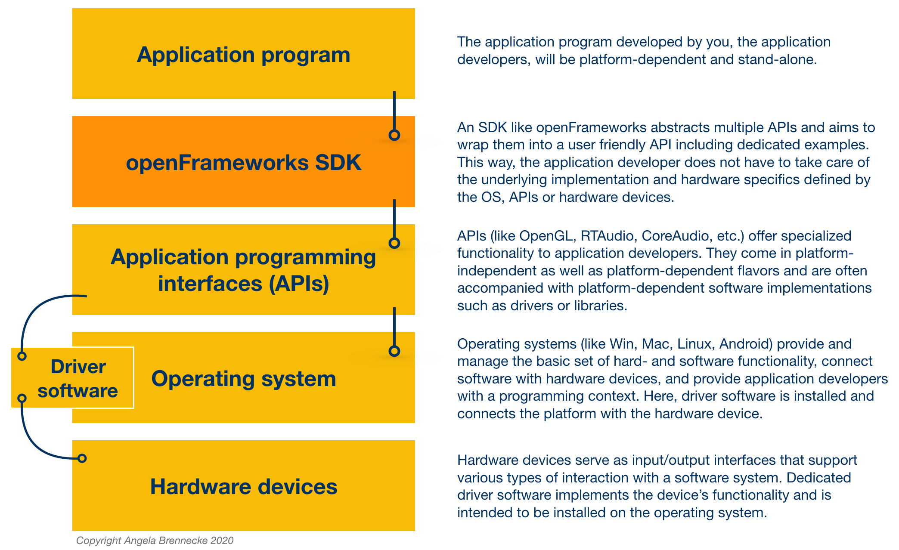
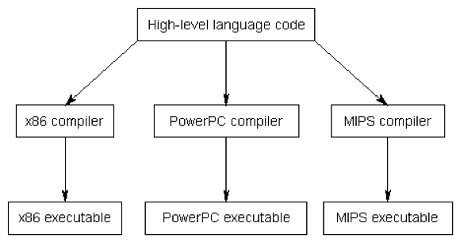
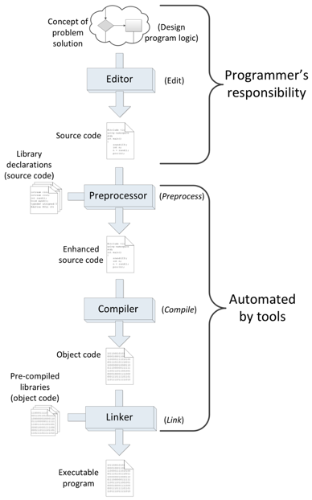

<!-- ---  
title: Creative Coding II
author: Angela Brennecke
affiliation: Film University Babelsberg KONRAD WOLF
date: Summer term 20
---   -->
**Creative Coding II - Summerterm 20**

Prof. Dr. Angela Brennecke | a.brennecke@filmuniversitaet.de | Film University Babelsberg *KONRAD WOLF*

---

**Table of Contents**
- [What is openFrameworks?](#what-is-openframeworks)
  - [Processing and openFrameworks](#processing-and-openframeworks)
  - [Platform-Dependent IDE and Development](#platform-dependent-ide-and-development)
  - [Software interfaces, APIs, and SDKs](#software-interfaces-apis-and-sdks)
  - [openFrameworks Addons](#openframeworks-addons)
- [Setup and Installation](#setup-and-installation)
  - [openFrameworks](#openframeworks)
  - [Integrated Development Environment](#integrated-development-environment)
    - [macOS and XCode](#macos-and-xcode)
    - [Windows and Visual Studio](#windows-and-visual-studio)
  - [The openFrameworks SDK](#the-openframeworks-sdk)
- [Building a First ofExample](#building-a-first-ofexample)
- [The Build Process](#the-build-process)
  - [Compiled vs interpreted Languages](#compiled-vs-interpreted-languages)
  - [Components of the Build Process](#components-of-the-build-process)
  - [Compiler and Linker Errors](#compiler-and-linker-errors)
  - [Reading Material](#reading-material)
- [Additional Learning Ressources](#additional-learning-ressources)

---

# What is openFrameworks?

[openFrameworks](https://openframeworks.cc) is free, open source C++ software development kit (SDK) that takes a development approach similar to the Processing environment. Interestingly, both toolkits [originate from the Massachusetts Institute of Technology (MIT)](https://openframeworks.cc/ofBook/chapters/foreword.html). The openFrameworks SDK targets easy development of **real-time** and **close-to-the-hardware applications** and is primarily designed for use in creative and experimental projects. It is cross-platform and supports systems such as OS X, Windows, Linux, iOS, Android & Linux ARM devices such as Raspberry Pi. 

## Processing and openFrameworks

In contrast to Processing, openFrameworks does not come with an integrated development environment right away. Instead, openFrameworks comes with a set of **C++ source files** (comprised of header *.h and definition *.cpp files) and system-dependent **pre-compiled libraries** (file extensions *.a on macOS, *.lib on Windows). These have to be processed as part of a compilation and build process which results in an  openFrameworks application. 

The resulting application **binary or executable** can be launched by the operating system (OS) as a standalone application and runs independently from the development environment. In the case of Processing, in contrast, the resulting application sketch requires the Processing IDE for launching and running the sketch. This can be more convenient in many cases but has its limitations when it comes to real-time applications that require time consuming computations, for example. Since recently Processing sketches can be exported as **standalone** applications, too. 

## Platform-Dependent IDE and Development

To build an openFrameworks/C++ application, a platform-dependent **integrated development environment (IDE)** is required. Such an IDE is used 
- to **compile** and **link** the source files in order 
- to **build** the application (file extensions *.app on macOS, *.exe on Windows).   

openFrameworks applications can be build with [several IDEs](https://openframeworks.cc/download/). In this course, however, we will use  **XCode** on macOS and **MS Visual Studio Community 2017** on Windows.

macOS and Apple computers come with different implementations for how to use and connect with OS-software and hardware devices than do Microsoft and Windows computers. The same is true for Linux as well as any of the embedded systems. An advantage of the **platform-dependent development** with C++ is the ability to create applications that can apply the platform's software and hardware resources directly. 

## Software interfaces, APIs, and SDKs

Imagine you would like to implement an application that allows you to record incoming audio from your soundcard. On macOS you could use functionality provided by [Core Audio](https://developer.apple.com/library/archive/documentation/MusicAudio/Conceptual/CoreAudioOverview/Introduction/Introduction.html#//apple_ref/doc/uid/TP40003577-CH1-SW1) which represents the standard macOS software interfaces for audio development. On Windows platforms different software interfaces exist that allow you to implement how your application connects with soundcards and audio interfaces. Here you could use functionality provided by **Directsound** or **WASAPI** (Windows Audio Session API) which are part of the [Windows Core Audio APIs](https://docs.microsoft.com/en-us/windows/win32/coreaudio/core-audio-apis-in-windows-vista). The same applies for other devices like graphics cards, webcams as well as certain functionality handled by the operating system.

Since it can be rather tedious for an application developer to take care of all of the individual APIs themselves, certain software development kits package multiple APIs and useful functionality into a uniform set of functions. openFrameworks does exactly that. It takes care of creating a graphical window, listening for mouse and keyboard events, processes incoming and outgoing audio streams, 3d graphics, image and video processing, and many more. This way, developers can start with expressing their ideas fairly quickly and at the same time work with an optimal connection to their hardware resources. 

In the context of platform-dependent development with openFrameworks, it will be helpful to develop an understanding of the following terms:

* The term **software interface** is a general description for how software programs can interact and communicate with each other, exchange data or execute functions. 

* The term **application programming interface** (API) is a formal description of a software interface. It is used to specify a certain part of an application program that allows other programs to connect with it.

* The term **software development kit** (SDK) describes a set of software interaces as well as additional development tools that support application programmers to develop and implement a software application. Additional development tools might, for example, be APIs, documentation, example code, precompiled libraries, scripts or executables. 

The following diagram illustrates the different soft- and hardware layers and their relationships. The blue connection points can be considered software interfaces:

## openFrameworks Addons

openFrameworks is also highly extensible and provides a dedicated mechanism to involve additional functionality through the use of [ofxAddons](https://ofxaddons.com/categories). These are usually open source and add specific or custom functionality to the SDK. Addons are generally built and maintained by members of the openFrameworks community. The downside here is that not all of the addons are maintained continuously. Hence, several addons are outdated and no longer compatible with the latest openFrameworks version. Once you understand how C++ and openFrameworks work, you can workaround this and update an outdated ofxAddon yourselves ;-)

One source of support that might help you with this and many other openFrameworks related questions is the [openFrameworks forum](https://forum.openframeworks.cc). openFramework has a very friendly & active community and it is recommended to search the forum for further information or to create an account to ask questions about specific aspects of the software. 

# Setup and Installation

In order to build your own openFrameworks applications, you will need to download the openFrameworks SDK as well as an IDE for your platform. Follow the description below. If you have questions and problems during the installation, make use of the [openFrameworks forum](ttps://forum.openframeworks.cc) which contains lots of useful hints and discussions.

## openFrameworks 
Download the latest version of openFrameworks for the platform you will be working on, i.e., macOS and Windows, from this website https://openframeworks.cc/download/: 
- "download openFrameworks for osx"
- "download openFrameworks for visual studio (2017)"

Once you have downloaded openFrameworks, extract the zip file to a folder location from where you would like to work. You do not have to install anything in order to work with the SDK except for an IDE. Further documentation on the technical requirements and environment setup is available in these files

- of\_root\_folder/README.md
- of\_root\_folder/INSTALL.md
- of\_root\_folder/docs/

## Integrated Development Environment

In this course, we will use **XCode** for macOS and **MS Visual Studio Community 2017** ("Visual Studio" or simply "vs") for Windows platforms. 

Central features of the IDEs are:
1. A **text editor** usually with syntax highlighting.
2. A **debugger** to step through the code during runtime and in order to identify mistakes and bugs.
3. A **build environment** that processes, compiles, and links the source code.

The IDEs feature more than that, for instance, they support version control, deployment facilities or additional code optimization tools. 

*Note: Other IDEs and platforms will work with openFrameworks as well but will require you to take care of the setup and processing yourselves. Visual Studio Code is a very good alternative that works on both platforms, macOS and Windows. However, at the moment it is [not possible to use the latest debugger on macOS Catalina with Visual Studio Code](https://github.com/microsoft/vscode-cpptools/issues/3829).*

### macOS and XCode
If you are working on **macOS**, you will need to download and install **Xcode**.  
- Follow the instructions here https://openframeworks.cc/setup/xcode/. 
- Checkout [this video to get a first impression of how to work with openFrameworks on MacOSX](https://www.youtube.com/watch?v=rplUouqg8mc)

### Windows and Visual Studio

If you are working on Windows, you will need to install **MS Visual Studio Community 2017**.   
- Follow the instructions here https://openframeworks.cc/setup/vs/. 
- Checkout [this video to get a first impression of how to work with openFrameworks on Windows](https://www.youtube.com/watch?v=DtD007zeztA)

## The openFrameworks SDK

Once your system is setup, checkout this introduction video on the openFrameworks SDK and its folder structure:

- *Link to the video*

# Building a First ofExample

Once you have installed the IDE on your platform and unpacked the downloaded openFrameworks SDK to a folder of your liking you can start building the example applications that come with openFrameworks. 

It is important to understand that you have to build the example applications with the help of the IDE. To do so, **double-click the project files** which will in turn launch the corresponding IDE:

- *.**xcodeproject** for XCode  
- *.**sln** for Windows

The project files contain all of the necessary information required to build an application. They heavily rely on the openFrameworks folder structure because they search the folders for all of the necessary files and information required to compile, link, and build the application. Any change to the folder structure should therefore be considered carefully as it might break the build process. Once you have opened the project file in the IDE, trigger the build process.

- *Link to the video*

# The Build Process

The build process takes care of turning **source code** into **executable software programs** also referred to as **executables** or **binary files**. 

  
*Image credit: http://www.learncpp.com | 0.2 — Introduction to programming languages*

These **executables** or **binaries** are sets of instructions that tell the computer how to operate. Therefore, 
the instructions have to be written in machine code. Machine code is a very low-level programming language with each instruction set being composed of bits, binary numbers like, for example, *10110000 01100001*. These instruction sets are different per CPU, i.e., MacOS, Windows, Linux, etc. binaries differ.

Each platform's operating system comes with a small program called **loader**. When executing the binary, i.e., by double-clicking it, the loader loads the binary file into the platform's random access memory (RAM) and the platform's CPU executes the machine code instructions.

## Compiled vs interpreted Languages

Generally, the build process is a **multi-step process** whereas the interpreter abstracts these steps and appears as a **one-step-process**. 

An interpreted language (e.g. Python or Processing) uses an interpreter that
- does not compile source code in machine code 
- is not necessarily optimized for the platform 
- directly executes the instructions itself

Nowadays interpreted language programs can compete often well with compiled languages.  are therefore generally still slower in program execution than compiled language programs that are executed directly by the CPU

## Components of the Build Process

The following diagram illustrates the development and build process for a compiled language like C++:

  
*Image credit: Richard L. Halterman (2017): Fundamentals of C++ Programming. Online print.*

- Preprocessing: Generates enhanced source code
- Compilation: Generates object files
- Linking: links all object files and generates the executable

## Compiler and Linker Errors

**Compiler errors** occur during compilation usually refer to syntax errors in the code
compiler error code is usually very helpful to identify and fix the compiler error.

**Linker errors** occur during linking of the object files and are often much harder to fix
usually refer to missing implementation details of the code 
 like, i.e., missing function definitions or libraries (path errors).

Examples presented.
## Reading Material

- https://www.learncpp.com/cpp-tutorial/introduction-to-the-compiler-linker-and-libraries/
- https://www.tutorialspoint.com/compiler_design/compiler_design_overview.htm

- Checkout the ofBook and skim through the first chapters. Take a close look at the openFrameworks folder structure:
  - https://openframeworks.cc/ofBook/chapters/foreword.html
  - https://openframeworks.cc/ofBook/chapters/of_philosophy.html
  - https://openframeworks.cc/ofBook/chapters/cplusplus_basics.html
  - https://openframeworks.cc/ofBook/chapters/setup_and_project_structure.html
- Get familiar with C++ syntax. Checkout https://wwww.learncpp.com:
  - Recap the build process with Chapter 0
  - Skim through Chapter 1, read 1.1, 1.3, 1.4, and 1.5 carefully
  - Skim through Chapter 2, read 2.1, 2.2, and 2.3

# Additional Learning Ressources

- https://openframeworks.cc/learning/
- https://github.com/openframeworks/openFrameworks/wiki/Resources-for-Learning
- http://codeliberation.org/CLF-slides/
- http://www.stroustrup.com/C++.html#guidelines