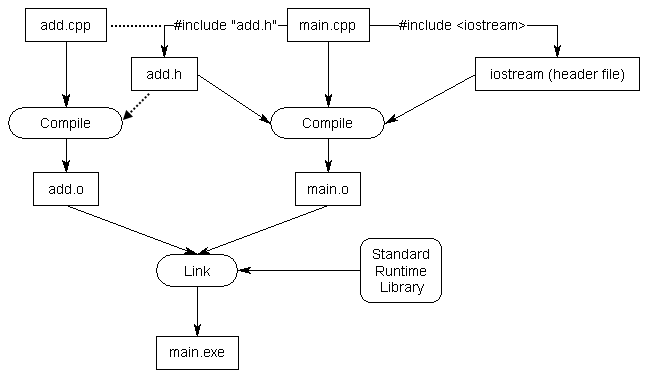

<!-- ---  
title: Creative Coding II
author: Angela Brennecke
affiliation: Film University Babelsberg KONRAD WOLF
date: Summer term 20
---   -->
**Creative Coding II - Summerterm 20**

Prof. Dr. Angela Brennecke | a.brennecke@filmuniversitaet.de | Film University Babelsberg *KONRAD WOLF*

Last Update: 

---

# The Build Process

## Source Code and Executable

The build process takes care of turning **source code** into executable software programs. 

  
*Image credit: http://www.learncpp.com | 0.2 — Introduction to programming languages*

These **executables** or **binaries** are sets of instructions that tell the computer how to operate. Therefore, 
the instructions have to be written in machine code. Machine code is a very low-level programming language with each instruction set being composed of bits, binary numbers like, for example, *10110000 01100001*. These instruction sets are different per CPU, i.e., MacOS, Windows, Linux, etc. binaries differ.

Each platform's operating system comes with a small program called **loader**. When executing the binary, i.e., by double-clicking it, the loader loads the binary file into the platform's random access memory (RAM) and the platform's CPU executes the machine code instructions.

## Compiled vs interpreted Languages

Generally, the build process is a **multi-step process** whereas the interpreter abstracts these steps and appears as a **one-step-process**. 

An interpreted language (e.g. Python or Processing) uses an interpreter that
- does not compile source code in machine code 
- is not necessarily optimized for the platform 
- directly executes the instructions itself

Nowadays interpreted language programs can compete often well with compiled languages.  are therefore generally still slower in program execution than compiled language programs that are executed directly by the CPU

## Components of the Build Process

The following diagram illustrates the development and build process for a compiled language like C++:

  
*Image credit: Richard L. Halterman (2017): Fundamentals of C++ Programming. Online print.*

- Preprocessing: Generates enhanced source code
- Compilation: Generates object files
- Linking: links all object files and generates the executable

## Compiler and Linker Errors

**Compiler errors** occur during compilation usually refer to syntax errors in the code
compiler error code is usually very helpful to identify and fix the compiler error.

**Linker errors** occur during linking of the object files and are often much harder to fix
usually refer to missing implementation details of the code 
 like, i.e., missing function definitions or libraries (path errors).

Examples presented.

## Reading Material

- https://www.learncpp.com/cpp-tutorial/introduction-to-the-compiler-linker-and-libraries/
- https://www.tutorialspoint.com/compiler_design/compiler_design_overview.htm

# Building an ofApp

## openFrameworks Folder Structure

We will review the folder structure by example and look into the following files more closely:

- Makefile
- addons.make
- config.make
- Project files
- Source files 

## The ofApp

Every ofApp is by default comprised of three files

- main.cpp -- This is the starting point for every C++ program!
- ofApp.h -- The header file
- ofApp.cpp -- The definition file (also simply called Cpp file)

### Header and Definition Files

The job of the header file is to declare all of the functionality that is being implemented in the definition file. This has several advantages such as 
- separating a concept from a specific implementation (where might this be useful?)
- organizing the source code 
- categorizing and abstracting functionality
- what else?

  
*Source: https://www.learncpp.com/cpp-tutorial/header-files/*

This is a more complex example that shows how to add functionality to a main.cpp file by including two different header files. The corresponding definition files are not affected by the inclusion. Including different header files will affect the compilation as the additional information will be compiled into the object files. Then, in a next step during linking, the implementation / definition of additional functionality will be linked into the final executable as an additional object file. Compiled languages support the combination and use of different functionalities into one final software program.

  
*Source: https://www.learncpp.com/cpp-tutorial/header-files/*

