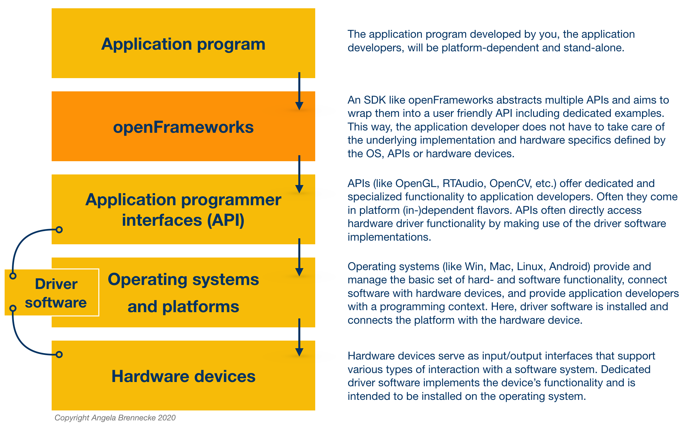

<!-- ---  
title: Creative Coding II
author: Angela Brennecke
affiliation: Film University Babelsberg KONRAD WOLF
date: Summer term 20
---   -->
**Creative Coding II - Summerterm 20**

Prof. Dr. Angela Brennecke | a.brennecke@filmuniversitaet.de | Film University Babelsberg *KONRAD WOLF*

Last Update: 

---

**Table of Contents**
- [Overview of the Course](#overview-of-the-course)
  - [Organization](#organization)
  - [Course Description](#course-description)
  - [Learning Objectives](#learning-objectives)
  - [Grading](#grading)
- [Communication & Materials](#communication--materials)
  - [Assignments](#assignments)
- [Further Readings](#further-readings)
  - [Books](#books)
  - [Online Resources](#online-resources)
- [openFrameworks Tour](#openframeworks-tour)
- [Technical Setup](#technical-setup)
  - [Integrated Development Environments](#integrated-development-environments)
  - [openFrameworks](#openframeworks)

---

# Overview of the Course

## Organization 

- Mondays and Wednesdays 11:30 h - 13 h
- Module 5 | 3 SWS | 4 ECTS
- 18 lectures in total

## Course Description 

This course builds on the concepts presented in ‘Creative Coding I’ and introduces the software development toolkit [openFrameworks](http://openframeworks.cc). openFrameworks is a creative coding toolkit dedicated to realtime development written in C++. We will specifically use it

- to introduce the C++ programming language & corresponding build processes,
- to explore object-orientation and realtime development with C++,
- to get familiar with software and library design.

openFrameworks is comprised of a huge body of example projects as well as additional functionality (ofxAddons) that we will explore during the course.

We will get to know the overarching topic of the course **interaction and interfaces** in larger and smaller projects. As an artistic starting point, we will deal with topics such as poetry, imagery or music and develop a digital representation and/or interpretation using openFrameworks.

There will be smaller term projects as well as a **final project** which will be an individual piece of work. The requirements and scope of the final project will be defined at the end of the lecture series. The project can be an individual as well as a group work. 

**Deadline for submitting the final project is September 30th, 2020.** To successfully submit your final project, upload the code, documentation, and any additional material required to a dedicated Git repository and share the link to the repository with Prof. Brennecke via email.

## Learning Objectives

- Extending your programming skills towards software design
- Object-oriented analysis and design
- Understanding and working with a high-level programming language like C++
- Understanding and working with a complex SDK like openFrameworks
- Expressing your artistic ideas by the means of C++ and openFrameworks
- Interpreting an artistic idea as a piece of software

## Grading

### Breakdown <!-- omit in toc -->

* 10% - Participation in classroom dicussions and critiques 
* 40% - Homework assignments
* 20% - Term project + documentation
* 30% - Final project + documentation

Team work (2 persons per team) and pair programming is encouraged.
  
### Grading criteria projects <!-- omit in toc -->

* Creativity and originality of the concept
* Craftsmanship in terms of system design and the technical reflection of the solution
* Engineering effort, code organization, code quality and clarity
* Quality of the documentation

---

# Communication & Materials

As a communication platform, we will use [GitHub.com](https://github.com/) to share code, lecture materials, comments, and submit homework and project assignments.

- [GitHub repository (public)](https://github.com/ctechfilmuniversity/sose20_cc2)
- [GitHub Wiki (public)](https://github.com/ctechfilmuniversity/sose20_cc2/wiki)
- [GitHub team (public)](https://github.com/orgs/ctechfilmuniversity/teams/sose20_cc2)

The repository will be used to share scripts (usually as readme.md) and slides, coding examples, homework and project materials. The Wiki will be maintained by the students to share information that might be useful for everyone, for example, dos and don'ts, useful links, results of homework assignments, and so on. The team will be used for discussion, comments, notes and any important announcements.

This course will start as an online course which requires everyone to work individually. You will have to work through materials and assignments on your own. There will be slots for discussions twice a week. Make sure that you are prepared when bringing your questions to those slots. Make use of the Github team as well as openFrameworks forum when you are stuck and post your questions there. We have to work together as a group and everyone is invited to help out. Also, there will be individual consultation options for everyone.

## Assignments

Assignments will be given at the end of each class. If the assignments comprise written or coded homework, please create a folder named <my_last_name>, add your solutions and upload the folder to the assignments folder of the corresponding session. See the readme.md inside of the assignments folder for any additional info as well as the list of assignments.

---

# Further Readings

## Books 

### Creative Coding <!-- omit in toc -->

- Joshua Noble (2009): Programming Interactivity. A Designer’s Guide to Processing, Arduino & openFrameworks. Sebastopol, CA: O’Reilly Media Inc.
- Ira Greenberg (2007): Processing: Creative Coding & Computational Art. Berkley, CA: Friends of ED/Apress Press.
- Bill Manaris & Andrews R. Brown (2014): Making Music with Computers. New York, NY: Chapman & Hall / CRC Press.

### C/C++  <!-- omit in toc -->

- Bjarne Stroustrup (2013): The C++ Programming Language. Upper Saddle River, NJ: Pearson Education, Inc.
- Bjarne Stroustrup (2014): Programming. Principles & Practices Using C++. Upper Saddle River, NJ: Addison-Wesley.
- Scott Meyers („Effective C++“ series, advanced)
- Herb Sutter („Exceptional C++“ series, really advanced)

### Software Design <!-- omit in toc -->

- Grady Booch (1994): Object-oriented Analysis and Design. Addison-Wesley. NY, USA.
- Robert C. Martin (2009): Clean Code. Prentice Hall. NY, USA.
- Robert C. Martin (2017): Clean Architecture. Prentice Hall. NY, USA.

## Online Resources

- [learncpp](http://www.learncpp.com)
- [cppreference](http://www.cppreference.com/)
- [cplusplus](http://www.cplusplus.com/)
- [fluentcpp](https://www.fluentcpp.com)
- [ofBook](https://github.com/openframeworks/ofBook/tree/master/chapters)
- [openFrameworks](https://openframeworks.cc/)
- [openFrameworks Forum](http://forum.openframeworks.cc/)

# openFrameworks Tour

openFrameworks is free, open source C++ framework that has been strongly influenced by the Processing environment. The SDK targets easy development of real-time applications and is primarily oriented for use in creative and experimental projects.

openFrameworks takes care of creating a graphical window, listening for mouse and keyboard events, processes incoming and outgoing audio streams, etc. so developers can start with expressing their ideas fairly quickly. Additionally, openFrameworks is highly extensible using addons called *ofxAddonName*. These are usually open source and add specific or custom functionality to the SDK. Addons are generally built and maintained by members of the openFrameworks community. This can result in outdated software versions that are no longer compatible with the latest openFrameworks version, however.

openFrameworks is cross-platform and supports various platforms like OS X, Windows, Linux, iOS, Android & Linux ARM devices such as Raspberry Pi. Finally, it has a very friendly & active community and it is recommended to search the openFrameworks forum for further information or to create an account to ask questions about specific aspects of the software. The following diagram illustrates how openFrameworks relates to the final application and the underlying platform-specific components:

Let's check out the SDK folders and files with some examples.

# Technical Setup

## Integrated Development Environments

To create an application with openFrameworks/C++, a dedicated development process has to be evoked. This is usually done with a platform-dependent integrated development environment (IDE) . An IDE is comprised of three fundamental components that are usually freely customizable by the developer:
1. A text editor usually with syntax highlighting.
2. A debugger to step through the code during runtime and in order to identify mistakes and bugs.
3. A compiler, linker, and build environment.

Nowadays IDEs feature more than that, for instance, they often support integration of tools like version control, deployment facilities, etc.

In this course, XCode and Visual Studio Community will be supported. Other IDEs and platforms will work with openFrameworks as well but will require an independent setup.

### Windows Users <!-- omit in toc -->

If you are using a Windows machine, most prominent IDEs are:
- MS Visual Studio Community
- VSCode with MSYS2 

### MacOSX Users <!-- omit in toc -->

If you are using a MacOS machine, most prominent IDEs are:
- XCode including the "command line tools"
- VSCode (command line tools are also required)

## openFrameworks

Go to [openFrameworks.cc/download](http://openframeworks.cc/download/) and download the right version for your platform. Check out the tutorials that cover the installation process per platform. 

- Windows and Visual Studio Community: https://openframeworks.cc/setup/vs/
- MacOSX and XCode: https://openframeworks.cc/setup/xcode/
- Linux: https://openframeworks.cc/setup/linux-install/

Once you have downloaded openFrameworks, extract the zip file to a folder from where you would like to work from. Further documentation on the technical requirements and environment setup is available in 

- of\_root/README.md
- of\_root/INSTALL.md
- of\_root/docs/

If you have questions and problems during the installation, make use of the openFrameworks forum which contains lots of useful hints and discussions as well as serve as an independent help and learning channel:
- https://forum.openframeworks.cc

### Additional Learning Ressources <!-- omit in toc -->

- https://openframeworks.cc/learning/
- https://github.com/openframeworks/openFrameworks/wiki/Resources-for-Learning
- http://codeliberation.org/CLF-slides/
