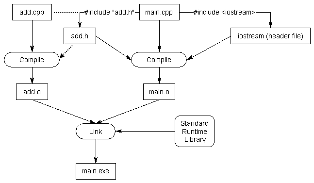

<!-- ---  
title: Creative Coding II
author: Angela Brennecke
affiliation: Film University Babelsberg KONRAD WOLF
date: Summer term 20
---   -->
**Creative Coding II - Summerterm 20**

Prof. Dr. Angela Brennecke | a.brennecke@filmuniversitaet.de | Film University Babelsberg *KONRAD WOLF*

---

**Table of Contents**
- [Learning Objectives](#learning-objectives)
- [C++ Basics](#c-basics)
  - [Introduction](#introduction)
  - [General Language Aspects](#general-language-aspects)
  - [Types](#types)
    - [Built-in Types](#built-in-types)
    - [User-defined Types](#user-defined-types)
      - [Type enum](#type-enum)
      - [Type struct](#type-struct)
  - [Variables](#variables)
    - [Declaration](#declaration)
    - [Initialization](#initialization)
    - [Assignment](#assignment)
  - [Functions](#functions)
    - [The main Function](#the-main-function)
    - [Declaration vs Definition](#declaration-vs-definition)
    - [Sequential Code Execution](#sequential-code-execution)
- [Building an ofApp](#building-an-ofapp)
  - [ProjectGenerator](#projectgenerator)
  - [The ofApp](#the-ofapp)
  - [Header and Definition Files TODO](#header-and-definition-files-todo)
    - [Further Considerations](#further-considerations)
- [Reading Material](#reading-material)
  - [Recap](#recap)
  - [Precap](#precap)

--- 

# Learning Objectives

- Getting started C++ language and syntax aspects
- Understanding header and definition files and their relationship
- Getting to know openFramework's ProjectGenerator
- Developing a first ofApp


# C++ Basics

## Introduction

C++ is a **high-level programming language** with a rich set of syntactic and semantic elements. In the last 10 years, the feature set of C++ has undergone several changes and the language is being improved on a regular level. The latest revision of C++ officially published by the ISO (International Organization for Standardization) working group is C++17 with C++20 being on its way. Find an overview at [ISO Cpp's current status page](https://isocpp.org/std/status). Whether or not you can use the language features of those revisions depends on the compiler you are using. This again shows how closely the programming language is interlinked with the translation unit that has to turn the high-level language into machine code.
Luckily when working with openFrameworks the pre-defined project-files ensure that you are using the appropriate compiler (version).

What makes C++ a long-lasting and successful programming language is the support of low-level ( == close to the hardware) as well as a high-level programming (== close to the human) programming at the same time. C++ is particularly well-known for its support of
- writing very efficient (real-time) software applications
- object-oriented programming
- generic programming
- software design capacities

Of course, there are also several critical voices arguing that C++ is too hard to learn, not state-of-the-art, and carries along too many concepts due to its long history. There is a truth in these arguments, too. Beware that it will be challenging to understand C++ concepts, to deal with compiler and linker errors and to be truely responsible for what you are doing. However, it will allow you to develop a deeper understanding of 

- how software and hardware interconnect
- the craft of software development 
- where modern programming concepts come from.

Checkout what [Bjarne Stroustrup](http://stroustrup.com), the creator and developer of C++, thinks about what are [five popular myths about C++](https://isocpp.org/blog/2014/12/myths-1).

## General Language Aspects

Remember from the previous lesson, C++ is a **compiled programming language**. It requires to be translated into machine code before it can actually be executed on a computer in the form of a C++ application binary. This translation was introduced as **C++ build process**. In addition to this C++ is also a **statically typed programming language** which means that all data types provided by the language have to be specified at compile time. This means that

- variables have to be associated with a specific data type and
- the type of the variable cannot change during the program's life time.

Why is that so? One main reason for this approach is **to allocate the memory required by the variables at compile time** in order **to ensure faster program execution**. Therefore, during compilation the compiler checks whether all associations between data types and variables and values stored in the variables are correct. This way, type errors are  identifed early in the development cycle which can also come in handy to identify conceptual mistakes.

In contrast to statically typed language, **dynamically typed languages** such as Javascript or Python do not associate data types with variables. Data types are dynamically defined and checked at run time and variable-type associations can change during program execution. 
The downside here is that conceptual flaws might enter the code and program execution is usually slower.


## Types 

C++ supports **built-in types** like integers, floating point or boolean values and **user-defined types** which can be designed and specified by the programmers. When you start working with data types in C++, consider them as digital representations of man-made concepts. For example, the data type **int** represents the concept of **integers**, i.e., whole numbers. The data type **int&** represents the concept of an *alias* or **reference to an integer**. 

Don't worry if you do not understand reference types right now. We will look at them closely in the upcoming sessions. Also, *please note* that we will not look into all of the available types and combinations of types in order not to overwhelm you right aways. To find out more about C++ types, checkout the online resources provided or [take a first tour of C++](https://isocpp.org/images/uploads/2-Tour-Basics.pdf).

### Built-in Types

Fundamental built-in types in C++ are types that represent mathematical concepts like numbers, logical operations and language / text concepts:

- **A Boolean type** called **bool** that represents either **true** or **false**  
- **Integer types** such as **int** that represent whole numbers like -3, -2, -1, 0, 1, 2, 3, ...
- **Floating point types** such as **float** that represent decimal numbers like -2.0, -1241.14523, 2345124.567435, -20.74, ...

```c++
int i{-120};
float f{3.145678};
bool b{true};
```


The newly introduced type **auto** allows for automatic type deduction. This means, the type of the variable that is defined as being of type auto is automatically deduced from the value assigned to it. The **auto** type can be very helpful to simplify the source code among others. At the same time, [variables of type auto](https://www.learncpp.com/cpp-tutorial/4-8-the-auto-keyword/) have to be initialized upon
creation.

```c++
auto i{-120};
auto f{3.145678};
auto b{true};
```

<!-- There is a type **void** that represents absence of information, i.e., the concept of **nothingness**. It is mostly used in the context of functions.

```c++
void myFunctionName () {
    // this function does not return a value
}
``` -->

In addition, C++ provides types that represent concepts of memory allocation, memory access & aliasing. These types are the reason why C++ is considered a language close-to-the-hardware. They are especially important when it comes to real-time programming and memory management and we will take our time in a future session to explore them closely:

- **Reference types** such as **int&**
- **Pointer types** such as **int\***

```c++
int size{450};             // variable "size" of type "int" stores a value of "450"
int& size_alias{size};     // variable "size_alias" of type "reference to int" is exactly the same as "size"
int* size_ptr{&size};      // variable "size_ptr" of type "pointer to int" stores the address in memory of "size"
```


### User-defined Types

User-defined types allow programmers to conceive and develop their own custom types and to translate theoretical concepts into software systems. 
Most prominent user-defined type is the [**C++ class**](https://www.learncpp.com/cpp-tutorial/82-classes-and-class-members/). However, there are also other user-defined types worth to check out like the [**enum**](https://www.learncpp.com/cpp-tutorial/45-enumerated-types/), an enumeration type, or [**struct**](https://www.learncpp.com/cpp-tutorial/47-structs/), which allows to combine different data types in one type. 

```c++
/*
The "enumeration" type can be used to group a list 
of symbolic constants (all of type integer) to make 
the code more comprehensible when working with lists:
*/
enum Color {    // define an enum called "Color"

    red,        // == 0
    yellow,     // == 1
    green       // == 2
};

// ...
Color myColor{yellow};  // create a variable of type Color
// ...


/* 
The "structure" type can be used to combine different data
types inside of one struct type. Accessing the different 
types inside a struct can be accomplished with the help
of the "." operator, for example:
*/

struct Point { 

    int x;
    int y;
    bool isVisible;
};

// ...
Point myPoint;      // create a variable of type Point
myPoint.x = 45;     // access its member variables
// ...
```

<!-- 
#### Type enum 
The **enumeration type** can be used to group a list of symbolic constants (all of type integer) like so:

```c++
// this preprocessor directive tells the compiler to include
// the "iostream" header file and its functionality. "iostream" is part
// of the C++ Standard Library (STL)
#include <iostream> 

enum Color {    // define an enum called "Color"

    red,        // == 0
    yellow,     // == 1
    green       // == 2
};

// In the main function, create a variable of user-defined type "Color". 
// Initialize "myColor" with "yellow".
// Print "myColor" to the command line (which is evoked by calling "std::cout").
// The command line will print "1".
int main( ) {
    
    Color myColor{yellow};
    std::cout << "myColor value " << myColor << std::endl;
}
```
#### Type struct

The **structure type** can be used to combine different data types inside of one struct type. Accessing the different types inside a struct can be accomplished with the help of the "." operator:

```c++
#include <iostream> 

struct Point {

    int x;
    int y;
    bool isVisible;
};

// In the main function, declare a variable "myPoint" of type "Point".
// Specify the different member variables of "myPoint".
// Print out the boolean variable's value to the command line.
int main( ) {
    
    Point myPoint;      
    myPoint.x = 45;
    myPoint.y = 45;
    myPoint.isVisible = false;

    std::cout << "Is my point visible? " << myPoint.isVisible << std::endl;
}
``` -->

The **class type** allows to define custom types by supporting 

- a combination of different data types 
- an integration of member functions 
- different access levels specified by **public**, **protected**, and **private** 

We will look into classes more closely in the next two sessions. For now, take note that the typical **class prototype** is usually specified in the **header file (*.h)** and contains all of the relevant variable and function **declarations**. The actual implementation 
is defined in the **definition** or **cpp file (*.cpp)** which usually contains all of the variable and function definitions. 

Exemplary myClass.h:
```c++
class myClass {

public:
    // member functions which describe the functionality of the class
    void setCoordinates(int xCoord, int yCoord);
    bool getVisibility();
    // ...

private: 
    // initialized member variables which can be of any type
    int x{0};
    int y{0};
    bool isVisible{false};
};
```

Exemplary myClass.cpp:
```cpp
#include "myClass.h"

//--------------------------------------------------------------
void myClass::setCoordinates(int xCoord, int yCoord) {

    x = xCoord;
    y = yCoord;
}

//--------------------------------------------------------------
bool myClass::getVisibility(){

    return isVisible;
}

// ...
```

## Variables

Variables are associated with a certain data type in the code.
There are different forms of variable initialization in C++ that you will find in most C++ source code. Therefore, a brief overview of the most important and commonly used forms of how to assign a value to a variable is presented in the following.

### Declaration

**Variable declaration** - The declaration of a variable simply tells the compiler about the existence of a variable. Most compilers automatically assign a random value to a declared variable. This might result in undefined behavior depending on how stable the source code is. It is therefore recommended to always initialize variables.

Declarations of auto variables are not allowed. This is becaues the compiler deduces the actual type of the variable automatically during compile time and based on the value assigned to the variable.
```cpp
bool test; 
auto grade;         // this will result in a compiler error 
auto grade2 {8};    // this works but is an initialization instead of a declaration
```

### Initialization

Initialization describes the process of specifying the value of a variable upon its creation. **To avoid undefined behavior, always initialize a variable.**

**Uniform initialization** - This is the new way to initialize variables in C++. Upon variable creation, a value is directly stored in its memory.
```c++
float grade {5.0}; 
auto grade {5.0}; 
```

**Copy initialization** - This is the classic way to initialize variables in older C++ versions, it is slower than uniform initalization but still widely used. The variable is created first and in a second step a variable is copied into its memory.
  
```cpp
int years = 4;     
auto years = 4 + 3; 
```

### Assignment 

**Copy assignments** - When changing the value of a variable, the new value is copied into the variable's slot in memory. 
```cpp
auto years {5};
years = 12;         // copy assignment
```

## Functions

Functions are essential building blocks of a computer program. They group statements into logical units and help organize the code. 
In C++, a typical function would look like this:

```c++
bool myFunction(int x, int y /* .. more or less or none */ ) {

    bool myBoolVariable = true;

    // do something with x and y and myBoolVariable
    
    return myBoolVariable;
}
```

As such, a function is defined by these parts:

* the function name — "bool ***myFunction*** (int x, int y) { ... }"
* the return type — "***bool*** myFunction (int x, int y) { ... }"
* the parameter list — "bool myFunction ***(int x, int y)*** { ... }"
* the function body — "bool myFunction (int x, int y) ***{ ... }***"


### The main Function

The [**main** function](https://en.cppreference.com/w/cpp/language/main_function) is a unique function that every C++ program must have. It is the starting point for every C++ program and is the first function that is being executed when the application binary gets launched. The return value of the **main** function is usually an error code. 

```c++
#include <iostream>

int main () {

    std::cout << "Hello, CTech World" << std::endl;
    return 0;
}
```


### Declaration vs Definition

A **function declaration** informs the compiler about the existence of a function similar to a variable declaration. It is defined by **function prototype** which includes

- the function name, 
- return type, 
- parameter list and 
- semicolon - not to forget -

but no function body like so:

```c++
bool myFunction(int x, int y);
```

A **function definition** in contrast additionally includes the function body like so: 

```c++
bool myFunction(int x, int y) {

    bool myBoolVariable = true;

    // do something with x and y and myBoolVariable
    
    return myBoolVariable;
}
```

### Sequential Code Execution

The separation of function declaration and function definition is primarily due to the [sequential execution of C++ source](https://www.learncpp.com/cpp-tutorial/introduction-to-the-compiler-linker-and-libraries/) code and helps to better organize the code. Programmers can simply list all of the functions used in the programm at the top of the source code (or in the header file) in the form of declarations. This way, the compiler knows exactly what kind of functions will be available before evaluating the function definitions. Check out the following examples for an illustration of the problem.

In the following source code example,  the **main** function initializes two integer variables and calls a function called **add** that adds both values and returns the result. In this code example, everything works fine. The compiler reads the source from top to bottom, knows about the add-function when reaching the function body of the main-function.

```cpp
// This example will compile fine.

int add(int x, int y)
{
    return x + y;
}

int main()
{
    int first{12};
    int second{45};

    int result = add(first, second);

    return 0;
}

```

In the following source code example, the compiler will throw an error because when it reaches the main-function, it does not know about the existence of the add-function.

```cpp
// This example will throw a compiler error!!

int main()
{
    int first{12};
    int second{45};

    int result = add(first, second);

    return 0;
}

int add(int x, int y)
{
    return x + y;
}

```


Finally in the following source code example, everything works fine again. The add-function has been declared at the top of the source code. As a result, the compiler knows about its existence when it reaches the main function and can continue to create object-code.

```cpp
// This example will compile fine.

int add(int x, int y);  // function declaration

int main()
{
    int first{12};
    int second{45};

    int result = add(first, second);

    return 0;
}

int add(int x, int y)
{
    return x + y;
}

```

The separation of declaration and definition is thus an essential aspect of source code management and, as you will find out later, of software design.


# Building an ofApp

## ProjectGenerator

The openFrameworks ProjectGenerator is a standalone application that comes with the SDK. Its main purpose is 

- to automatically create new project files for your IDE, 
- to update existing project files with the current folder structure,
- to include available addons to the project files.

Check out this screencast to learn how to use the ProjectGenerator:


*Attention: The video may take a couple of minutes to load.*

[](https://owncloud.gwdg.de/index.php/s/opsHlLvjIZTYOBs)


## The ofApp

By default, an ofApp is comprised of three files:

- main.cpp 
- ofApp.h - The header file that stores the software interface of an ofApp
- ofApp.cpp - The definition file that stores the implementation details of an ofApp

The ofApp is the default application class of openFrameworks that provides you with all of the necessary functionality to create and build an openFrameworks application binary. In this next screencast, we will develop a first custom ofApp application and take a closer look at the different aspects of the ofApp class.

Check out this screencast to learn about creating and building a custom of App:


*Attention: The video may take a couple of minutes to load.*

[](https://owncloud.gwdg.de/index.php/s/opsHlLvjIZTYOBs)


## Header and Definition Files TODO

The introduction of header and definition files can be considered a continuation of the separation of declaration and definition described in an earlier section.

- **The header file** is used **to declare all of the functionality**. 
- **The definition file** is used **to define and implement the funtionality**.

Apart from code organization this also has the advantage that it allows to separate a concept from a specific implementation. The following example illustrates the approach of using header and definition files and extends our earlier code example by a class "add". 

```cpp
#include <iostream>

int add(int x, int y);  // function declaration

int main()
{
    int first{12};
    int second{45};

    int result = add(first, second);

    return 0;
}

int add(int x, int y)
{
    return x + y;
}

```

This is a more complex example that shows how to add functionality to a main.cpp file by including two different header files. The corresponding definition files are not affected by the inclusion. Including different header files will affect the compilation as the additional information will be compiled into the object files. Then, in a next step during linking, the implementation / definition of additional functionality will be linked into the final executable as an additional object file. Compiled languages support the combination and use of different functionalities into one final software program.

  
*Source: https://www.learncpp.com/cpp-tutorial/header-files/*


### Further Considerations

 with a strong aspect on software design
In particular, header and definition files clearly support to separate 

- software interfaces (e.g., like declarations) from 
- implementation details (e.g., like definitions)

Software interfaces describe **what** kind of functionality is available whereas implementation details describe **how** the functionality is  implemented. It makes sense to separate both aspects, for example, when you think of OpenGL which provides a common software interface (API) and at the same time comes with different OpenGL implementations (OpenGL libraries/drivers) per platform and graphics card. 


# Reading Material

## Recap 

Revise and Review

- [C++ basics](https://openframeworks.cc/ofBook/chapters/cplusplus_basics.html) 
- [cpplearn.com](https://www.learncpp.com): Skim through chapters 1 & 2, read sections 1.1 to 1.4 and 2.1 to 2.3 carefully.
- [openFrameworks functions: setup, update, and draw](https://openframeworks.cc/ofBook/chapters/how_of_works.html)

## Precap

Prepare and Preview


