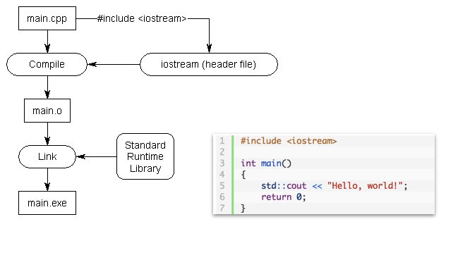

<!-- ---  
title: Creative Coding II
author: Angela Brennecke
affiliation: Film University Babelsberg KONRAD WOLF
date: Summer term 20
---   -->
**Creative Coding II - Summerterm 20**

Prof. Dr. Angela Brennecke | a.brennecke@filmuniversitaet.de | Film University Babelsberg *KONRAD WOLF*

Last Update: 

---

- sine wave examples
- move something around
- get used to the documentation
- find out about a function inside of the code

# Homework Assignments

- questions
- examples

# Building an ofApp

## ProjectGenerator

## Project Files

# Building an ofApp

## openFrameworks Folder Structure

We will review the folder structure by example and look into the following files more closely:

- Makefile
- addons.make
- config.make
- Project files
- Source files 

## The ofApp

Every ofApp is by default comprised of three files

- main.cpp -- This is the starting point for every C++ program!
- ofApp.h -- The header file
- ofApp.cpp -- The definition file (also simply called Cpp file)

### Header and Definition Files

The job of the header file is to declare all of the functionality that is being implemented in the definition file. This has several advantages such as 
- separating a concept from a specific implementation (where might this be useful?)
- organizing the source code 
- categorizing and abstracting functionality
- what else?

  
*Source: https://www.learncpp.com/cpp-tutorial/header-files/*

This is a more complex example that shows how to add functionality to a main.cpp file by including two different header files. The corresponding definition files are not affected by the inclusion. Including different header files will affect the compilation as the additional information will be compiled into the object files. Then, in a next step during linking, the implementation / definition of additional functionality will be linked into the final executable as an additional object file. Compiled languages support the combination and use of different functionalities into one final software program.

  
*Source: https://www.learncpp.com/cpp-tutorial/header-files/*

