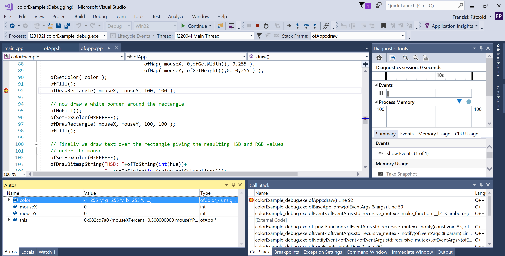
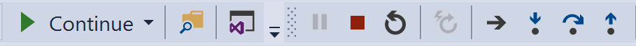

<!-- ---  
title: Creative Coding II
author: Franziska Pätzold
affiliation: Film University Babelsberg KONRAD WOLF
date: Summer term 20
---   -->

Franziska Pätzold | franziska.paetzold@filmuniversitaet.de | Film University Babelsberg *KONRAD WOLF*

---

## Debugging

_Hint: Debugging is a process to test your program and find mistakes. If you are not familiar with debugging it's definitely worth it to invest some time in learning about debugging in general. [Here](https://youtu.be/0ebzPwixrJA?t=289) is a video, where debugging is a little more explained in detail at Visual Studio (tip: start the video at 04:50.)_

Your UI will look a little bit different when you are debugging your project. 

To enter the debugging mode properly, please:

1. Set a breakpoint with a double click on the grey line next to the line number. (If there appears a red dot, like shown in the last picture, you successfully set a breakpoint.)
2. Start the debugging mode with the green arrow/Local Windows Debugger. 

Now some debugging tools appear: 

You can use them to execute the common debugging commands like "Step into", "Step over", "Step out"...
Simultaneously you can watch how your variables change in the lower left Autos window. 