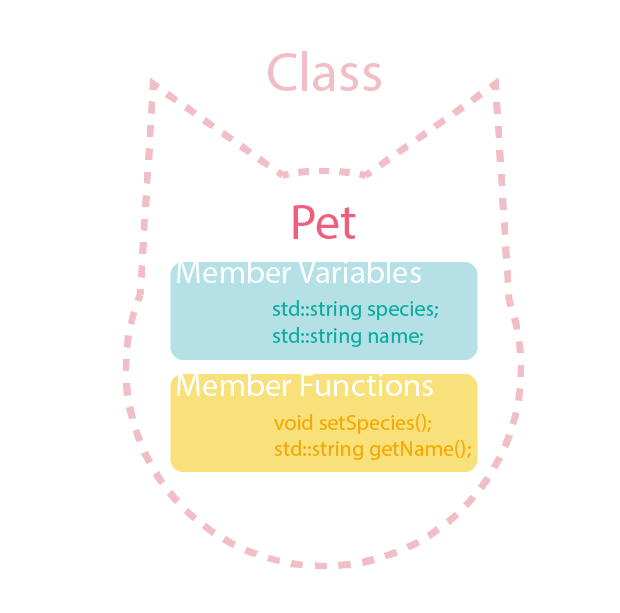
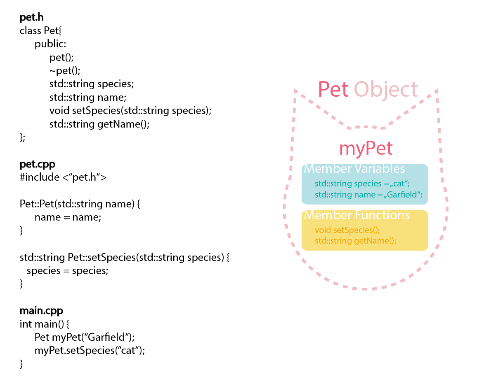

<!-- ---  
title: Creative Coding II
author: Angela Brennecke
affiliation: Film University Babelsberg KONRAD WOLF
date: Summer term 20
---   -->

**Creative Coding II - Summerterm 20**

Prof. Dr. Angela Brennecke | a.brennecke@filmuniversitaet.de | Film University Babelsberg *KONRAD WOLF*

---- 

**Table of Contents**  
- [Learning Objectives](#learning-objectives)
- [Object-oriented Programming (OOP)](#object-oriented-programming-oop)
  - [Theoretical Concepts](#theoretical-concepts)
  - [Classes & Objects](#classes--objects)
    - [Class Members](#class-members)
    - [Constructor & Destructor](#constructor--destructor)
      - [The default constructor](#the-default-constructor)
      - [The user-defined constructor](#the-user-defined-constructor)
      - [Destructor](#destructor)
    - [Object Instantiation & Member Access Levels](#object-instantiation--member-access-levels)
  - [Design Aspects](#design-aspects)
    - [Abstraction](#abstraction)
    - [Classes, Header, and Definition Files](#classes-header-and-definition-files)
    - [Time for Reflection](#time-for-reflection)
- [Additional C++ Specifics](#additional-c-specifics)
  - [C++ Standard Library (STL)](#c-standard-library-stl)
  - [Type Conversion](#type-conversion)
- [Reading Material](#reading-material)
  - [Recap](#recap)
  - [Precap](#precap)

---

# Learning Objectives

- Understanding the basics of object-oriented programming 
- Introducing object-oriented programming with C++
- Understanding the meaning of classes and objects in C++
- Getting a first idea of different levels of abstraction 

# Object-oriented Programming (OOP)

Object-oriented programming (OOP) is a programming paradigm that is based on the idea of creating and working with objects. An **object** in OOP is a digital entity which represents a certain concept or idea and, in doing so, which groups all functionality and properties required to represent that concept or idea into a user-defined data type called a **class**. 

For example, imagine you wanted to draw a simple pet character inside of your ofApp (or, imagine you wanted to draw a small circle that is animated following a sine wave based movement). You could go about this task by applying several function calls to ofDrawCircle, ofDrawRectangle, ofDrawTriangle, and so on in order to draw a pet character onto the screen. Your draw() function would probably become quite large. 

Now imagine you wanted to draw a small house as well, or a second pet. You would have to add additional function calls to ofDrawRectangle, for example, extending your draw() function further. The readability of your code would probably suffer and any interaction with the small pet character would probably be rather tedious to implement as well. 

 With OOP you might instead define a **user-defined data type**, a C++ class, called "pet" and move all of the functionality required to draw and represent your pet character into the class definition. The class is usually defined in a header file and groups all member variable and member function declarations. In the corresponding cpp file the member variables and member functions are being defined:
 
 ```cpp
// The class declaration is usually specified in a header 
// file like "pet.h"

// The keyword "class" followed by the class name 
// identifies the new user-defined type
class pet {

    // specify all properties of the pet character "object"
    // like height, color, shape, ...
    // ...

    // specify all functionality of the "object"
    // that indicates how to use it in the program, e.g.,
    int drawPet();
    // ...   
};
```

```cpp
// The class definition is usually specified in a 
// definition file like "pet.cpp"

# include "pet.h"

// ... 

void pet::drawPet() {

    // specify how to draw the pet character
}

// ...

```

 Then, in ofApp.h, you would simply add a variable of type "pet", instantiate it and call its' drawing routine, for example, like so:

```cpp
// ofApp.h

# include "pet.h"

class ofApp : ofBaseApp() {

    // ....
    pet happyCreature;      // add a member variable
}
```

```cpp
// ofApp.cpp

// ...
void ofApp::draw() {

    happyCreature.draw();   // call the object's drawing routine
}

// ... 
```

---
Check out this screencast to get started with object-oriented programming with C++:

*Attention: The video may take a couple of minutes to load.*

[](https://owncloud.gwdg.de/index.php/s/ffUVr29ZugAZmgi)

You'll find the [corresponding illustration](additional_material/oop_intro_screencast.pdf) in the additional_material folder.

---

In its essence, OOP is a very straightforward approach to software development which targets to simplify the development process. On a practical level, object-oriented design will help you to better organize your code, to make it more readable and to better categorize individual elements. 
On a software design level, object-oriented design will help you to reflect on your program from a conceptual point of view and to identify:
  - What kind of elements, components, or simply *objects* do you actually need and use?
  - How do they relate to each other?  
  - What kind of properties and what kind of functionality do they represent?


## Theoretical Concepts

There are four main theoretical concepts related to OOP that we will get to know during the next sessions. These concepts are 

- Abstraction 
- Encapsulation
- Inheritance
- Polymorphism 

**Abstraction** is an approch to hiding complexity and increasing efficiency by using functions and objects to abstract from implementation details and enhancing readability. 

**Encapsulation** is an approach to identifying and grouping together all properties, data, and functionalities that belong to and represent a certain concept in one object.

**Inheritance** is an approach to creating an object hierarchy in order to share properties and functionality and to specify a hierarchical child-object is-a parent-object relationship. 

**Polymorphism** is an approach to managing hierarchical groups of objects with the help of pointers and to additionally specify the relationships expressed by the hierarchy.

Don't worry if you do not understand all of these theories at this point. We will revisit them during the upcoming sessions again and again.

## Classes & Objects

Following [the explanation at cplusplus.com](http://www.cplusplus.com/doc/tutorial/classes/), *classes are user-defined data types in C++ and objects are instantiations of classes. If you think of variables, a class would be the variable type whereas the object itself would be the actual variable that can be used in the code.* 

Classes are blueprints of objects. Based on **a class definition**, **various object instances** can be created. This is just like with any other data type. For example, consider an **integer**. In your code, you can use several variables of type integer. Likewise you can instantiate several objects of type **class** ... or, as you might as well say, you can use several variables of type **class**.

### Class Members

As you have already seen in the previous screencast, every class is specified by

* **Class name** (which is used like any other type specifier, e.g., int, float, or bool)
* **Member variables**, 
* **Member functions**.


**Member variables** are defined inside of the class definition to represent the actual data members and / or data structures required and used by the class.

**Member functions** are defined inside of the class definition to represent all of the functionality to access and manipulate the data members and to interact with the object itself.

 ```cpp
// The declaration and definition of class members inside
//  "pet.h" and "pet.cpp"

class pet {

    // specify all properties of the pet character "object"
    // like height, color, shape as member variables
    int heightOfChar;
    ofColor colorOfChar;
    bool shapeIsRound;
    // ...


    // specify all functionality of the "object"
    // that indicates how to use it in the program as
    // member functions
    int drawPet();
    void movePet();
    // ...   
};
```


Additionally, classes consist of 
* **constructor & destructor**, specific member functions
* specification of **access levels** (private, protected, public) 
* potentially, specifications of **relationships** to other classes (e.g., through inheritance, friendships, etc.)


**Please** [refer to this explanation](http://www.cppforschool.com/tutorial/classobject.html) for an example of classes and objects.

### Constructor & Destructor

Every class has two special member functions called 
constructor and destructor. As the name suggests, the constructor is required to **construct** the object and to initialize all of the data members of the class whereas the destructor is required to properly **destroy** the object and its data members when its lifetime ends. This constructor is always called when an object of that class is being instantiated. The destructor is called when the object's lifetime ends.

 ```cpp
// The declaration and definition of class members inside
//  "pet.h" and "pet.cpp"

class pet {

    // class constructor 
    // default constructor that can be omitted
    pet();
    // custom or user-defined constructors
    pet(int theHeight);     
    pet(int theHeight, ofColor theColor);
    pet(int theWidth);      // !! this will result in a compiler error - constructor function prototypes MUST differ
    // ...   

    // class destructor
    // there is only ONE destructor per class which gets called
    // when the object runs out of scope / its lifetime ends
    ~pet();
};
```

#### The default constructor

If the class does not specify a constructor, the **compiler generates a default constructor automatically**. This is the case, for example, in the ofApp class. The default constructor initializes all data members to their default values.

#### The user-defined constructor

Every class can also **have (additional) user-defined constructors** which can be used to directly initialize member variables to specific values other than the default values. The function prototypes of the constructors **must differ** from each other! 

#### Destructor

Like the constructor, every class must specify a  destructor. If the class does not have an explicit default destructor, **the compiler generates one automatically**. Destructors are particularly important when a class member variable allocates dynamic memory — as we will see later. In general, the destructor takes care of cleaning up the object if that is required.

**Please** [refer to this explanation](http://www.cppforschool.com/tutorial/constructor.html) to get a better understanding of the constructor and destructor functionality and use.


### Object Instantiation & Member Access Levels

Object instantiation is simply done by using the class name as type specifier and by associating a variable with an object instance. 
Through the variable, all member functions and member variables that are defined as "public" can be accessed using the "." syntax like so:

```cpp
#include pet.h

// for instance, instantiate an object in main function
void someFunction () {

    pet charObject;          // create an object instance

    charObject.drawPet();      // calling a public member function
    charObject.heightOfChar = 10;
    charObject.shapeIsRound = false; 

}

```

However, in the current class definition, none of the above code will work because all of the member functions and variables have been declared **private**. If no further specificaton is given in the class definition, all members will be under private access level. 

**Access levels** help you define how you want your object be used and how you want the data members and function members be accessed **from outside of the class**.

- **Public** Every member variable and/or function defined under public can be accessed from outside of the class. 

- **Protected** Every member variable and/or function defined under protected can be accessed from inside of the class and from inside of the inherited class(es) only — not from outside of the class

- **Private** Every member definition in a class is declared as private by default — if not specified otherwise. Every member variable and/or function defined under private can only be accessed from inside of the class — not from outside of the class

In the following example, public and private access levels have been added to the class definition. This way, in the previous code example only the access of the "shapeIsRound" variable will cause a compiler error.

 ```cpp
// Adding access levels to the class 

class pet {

// adding public access level to the class in order to
// actually access it when instantiated
public:
    pet();
    // ... 
    ~pet();

    int drawPet();
    void movePet();

    int heightOfChar;
    ofColor colorOfChar;

// adding private access level to restrict the access to certain 
// data members
private:

    bool shapeIsRound;

};
```

Member variable "shapeIsRound" had been specified as "private" and can not be accessed from outside of the class. The "shapeIsRound" variable can only be accessed from inside of the class like so:

```cpp
#include pet.h

// ...

// This is a member function definition as defined
// by associating the function name "drawPet" with
// the class name "pet::drawPet".
void pet::drawPet () {

    shapeIsRound = w;
}

// ...
```

 Please review also the following two illustrations which describe the difference between a class type and concrete object graphically:


*Copyright by Franziska Pätzold.*


*Copyright by Franziska Pätzold.*

---
**Note**: This screencast is going to be recorded in a live session. Check it out once it is uploaded to learn about class design and how to work with an object in C++:
<!-- 
*Attention: The video may take a couple of minutes to load.* -->

[]()

---


## Design Aspects

A rule of thumb for good class design is to ensure that  data members are *private* and can be accessed and manipulated by *public* function members. This way, a **solid public interface** can be designed which remains *as is* even when the underlying data members change. Additionally, this way any kind of manipulation of member variable values is restricted to the class only.

### Abstraction

Object-oriented programming offers a way to group and encapsulate functionality and properties in individual objects. Central benefit of this approach is the reduction of complexity and the introduction of levels of abstractions to the code. All of the implementation details needed to implement the simple pet character is moved to the object's class definition. In the main routine, i.e., in ofApp in our example, you only have to work with the pet object itself. This makes it easier to understand the code and supports the software design process.

Access levels are a C++ mechanism to support abstraction. 
In that regard, 
- The public keyword specifies the interface level of a class
- The protected keyword specifies the inheritance and hierarchical level
- The private keyword specifies the implementation details level, i.e., every 

### Classes, Header, and Definition Files

On a software design level, the [separation of header and definition files](http://www.cppforschool.com/tutorial/separate-header-and-implementation-files.html) clearly supports to distinguish between 

- **The what** - software interfaces, e.g., like class design and declarations, and
- **The how** - implementation details, e.g., like object instanciations and definitions in general.


Software interfaces describe **what** kind of functionality is available whereas implementation details describe **how** the functionality is implemented. It makes sense to separate both aspects, for example, when you think of OpenGL which provides a common software interface (API) and at the same time comes with different OpenGL implementations (OpenGL libraries/drivers) per platform and graphics card. The same is true in the context of the openFrameworks SDK.

### Time for Reflection

The advantage of object-oriented programming is

- To translate real-world concepts into digital concepts.
- To use several objects of the same class in the ofApp without having to repeat code.
- To configure unique objects following the specification defined in the class.

Why?

# Additional C++ Specifics

## C++ Standard Library (STL)

Before you go start with the assignments, I would like you to do a little research and learn about the **C++ Standard Library (STL)**. This library provides additional functionality in the form of 

- data structures
- algorithms

to C++. You have already encountered STL functionality when learning about **std::cout**  and **std::endl** function calls. 
 
 Please [refer to this overview](http://www.cppforschool.com/tutorial/libraryfunc.html) and read this material to learn about a central data structure, i.e., [std::vector](https://openframeworks.cc/ofBook/chapters/stl_vector.html). Please note, use the material to get a first understanding and introduction to the data structure. To dive deeper, check out [std::vector at learncpp.com](https://www.learncpp.com/cpp-tutorial/6-16-an-introduction-to-stdvector/).

## Type Conversion

In the last session you have learned that C++ is a statically typed language. This means, that a variable is associated with the type it was initialized with and cannot change. However, with **type conversion** variable values can be cast from one type to another type. 

Please [refer to the slides on type conversion](additional_material/type_conversion.pdf) in the *addition_material* folder for an introduction to type conversion. 

Refer to the corresponding chapter at cpplearn.com on [implicit type conversion](https://www.learncpp.com/cpp-tutorial/implicit-type-conversion-coercion/) and [explicit type conversion](https://www.learncpp.com/cpp-tutorial/explicit-type-conversion-casting-and-static-cast/) if you want to dive deeper.


# Reading Material

## Recap 

Revise and Review

- [Object-oriented Programming (OOP) & openFrameworks/C++](https://openframeworks.cc/ofBook/chapters/OOPs!.html)
  - Note that this introduction is not flawless but it gives you a good idea about how OOP works with openFrameworks
- [A very interesting article on abstraction levels and coding](https://www.fluentcpp.com/2016/12/15/respect-levels-of-abstraction/) (Recommended!)
- All the links previously added in the script.

## Precap

-- relax for now and focus on coding --


