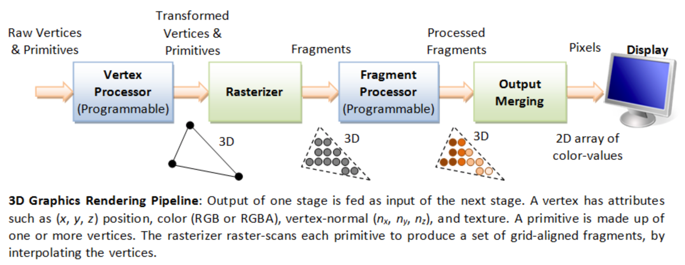

<!-- ---  
title: Creative Coding II
author: Angela Brennecke
affiliation: Film University Babelsberg KONRAD WOLF
date: Summer term 20
---   -->
**Creative Coding II - Summerterm 20**

Prof. Dr. Angela Brennecke | a.brennecke@filmuniversitaet.de | Film University Babelsberg *KONRAD WOLF*

---

**Table of Contents**
- [Learning Objectives](#learning-objectives)
- [Review \& Preview](#review--preview)
- [Interaction \& Interfaces](#interaction--interfaces)
- [Image Representations](#image-representations)
  - [Graphics Hardware](#graphics-hardware)
  - [openFrameworks Concept](#openframeworks-concept)
  - [openFrameworks & Image Handling](#openframeworks--image-handling)
    - [ofImage](#ofimage)
    - [ofPixel](#ofpixel)
    - [ofTexture](#oftexture)
    - [ofFbo](#offbo)
- [Reading Material](#reading-material)
  - [Recap](#recap)
  - [Precap](#precap)
  - [References](#references)

--- 

# Learning Objectives

- Interaction and interfaces
- Image representations
- Frame buffer objects

Time Estimate: This session will approximately take 6-8 hours of time in total including script and assignments. It compensates slightly for the last session that might have taken less than 8 hours. Please send me a note how much time you took for the las

# Review \& Preview

In the last three sessions, we covered three fundamental topics required to get started with C++/openFrameworks based development:

- We looked into the different abstraction layers of hardware, driver software, APIs, SDKs, and finally custom application development to get a better understanding of how the technical components are related and depend on each other.
- We looked into the basics of the C++ programming language, the platform dependent build process, and how we can actually debug an application and dig into the underlying technological structures. 
- We looked into the basics of object-oriented programming to get started with reconsidering the development process from the perspective of objects and components in order to improve our code base and system design in terms of structure and abstraction.

From now on, we will look into **specific topics of openFrameworks** such as image representations and manipulations, audio programming, a glance into shader development and the image processing library openCV that can be integrated into openFrameworks in the form of an addon. We will also take a look at memory management with C++ and continuously review the object-oriented programming paradigms. All of these topics, we will review in the light of **interaction and interfaces**, the main theme of this lecture. 

# Interaction \& Interfaces

Interaction and interfaces  is what we have already touched upon with the first exercises on interactive sine wave drawings as well as with the technical application programming interfaces (APIs) that we briefly discussed. Moreover, we saw a couple of interactive artistic pieces by some of your favorite artists.

In the context of creative coding and creative technologies, we will now start to involve and invite aspects of interaction and interfaces into the practical exercises and we will aim for developing **our own understanding of interaction and interfaces** during the remainder of this course.


In his book **Programming Interactivity** [JNoble2009], Joshua Noble discusses several forms of interaction from the perspective of interaction design and interactive digital art programs. According to him, 

> Interaction could be defined as the exchange of information between two or more active participants. The writer and video game designer Chris Crawford describes interaction as “an iterative process of listening, thinking, and speaking between two or more actors.”  Generally, when we’re talking about interaction and programming it’s because one element in the interaction is a computer system of some sort or some control element that a person is trying to get to do something. The person for whom the computer or mechanical system is being designed is called the user, and what the user is using is called the system. There are many different terms floating around today, such as *human computer interaction*, *computer human interaction*, or *experience design*. All mean more or less the same thing: designing a system of some sort that a person can interact with in a way that is meaningful to them. **[JNoble2009, p. 5]**


Moreover, the following excerpt is part of Noble's discussion of the term **interface**:
> The interface is the medium of the communication between the user and the system. It drives a lot of what is possible and what is not possible, what is efficient and what isn’t, and what the tone of the interaction is. If you think about how you talk to someone on the phone versus how you talk to them in person, you’re probably using more hand gestures, facial expressions, and other forms of nonverbal communication in person and being more direct and using your tone of voice more when you are on the phone. What we use to do something affects a lot of how we do that thing. Having a functional, expressive, and attractive interface is very important in creating the means for an interaction to occur. The attractiveness of an interface is an important part of making an interaction pleasant to a use; the colors, text, symmetry, sounds, and graphics are important and are communicative elements that shape a great deal about what a user thinks about your system. **[JNoble2009, p. 9]**

Hence, interaction and interface are closely related concepts. Another essential aspect of the above mentioned discussions on interaction and interface is the term **communication** which could be described as the transfer and exchange of information. 

When reconsidering these concepts and the citations above, what are the main aspects of either interaction and interface? Could you, for example, understand an **interaction** as a formal process description on a technical level? If so, how would you define it?

In contrast, could you, for example, understand an **interface** as a clear specification of how the interaction has to be executed in the first place? What is your take on this interpretation? 

 Considering creative coding and (interactive) digital art, the first part of the homework assignments will revolve around these definitions and terms. Central task will be to come up with an individual or personal definition of interaction, interfaces and communication seen through the eyes of 

- a creative technologist and how you would like to develop/design an application
- an artist and how you would like to interact with an audience
- an audience and how do you perceive interaction in an artistic piece, e.g., made by your favorite artists

Based on that, we will continue finetuning the definitions and will discuss them against the background of the upcoming topics.

# Image Representations 

## Graphics Hardware 

Modern computer hardware usually provides for a special [graphics subsystem](https://www.ntu.edu.sg/home/ehchua/programming/opengl/cg_basicstheory.html) that is responsible for processing, rendering, and displaying **computer generated images**. The subsystem contains a graphics processing unit (GPU) and a corresponding random access memory component dedicated to handling video and graphics data only. Furthermore, the subsystem also takes care of the **frame buffer** which stores all the processed image information at pixel level before they are handed over to the output monitor for display. 

The approach allows the capacities of the central processing unit (CPU) and the corresponding main memory to be kept free for all other necessary calculations that revolve around the operating system or user input, for example. The CPU might also take care of handling **image files** and feeding **pixel** data from these images to the GPU for further processing, i.e., in the form of **textures**. Hence, not all of the operations related to image processing are handled on the GPU alone. The following system diagram depicts the general concept:

*Image source: https://www.ntu.edu.sg/home/ehchua/programming/opengl/cg_basicstheory.html*

## openFrameworks Concept

In openFrameworks, the separation between general (or CPU-based) calculations, special graphics (or GPU-based) calculations, and all calculations that refer to user input (CPU-based) has been mapped to different functions in ofApp class, respectively:

- **update**() function dedicated to any general calculation
- **draw**() function dedicated to graphics based calculations
- **keyboard** and **mouse input** functions dedicated to user input calculations.

All of them are continuously evaluated and executed by the underlying openFrameworks SDK at a specified frame rate. In particular, draw() function is intended on a design level to aggregate any calculation related to graphics processing and to transfer all of them to the underlying rendering unit that is based on OpenGL.

**Please** [refer to this link on 3D graphics with OpenGL ](https://www.ntu.edu.sg/home/ehchua/programming/opengl/cg_basicstheory.html) and read chapter 1 on computer graphics hardware for more details on the following aspects:

- pixels and frame 
- frame buffer and refresh rate (and _frame rate_)
- double buffering an VSync

In the following sections, we will explore the classes and functions povided by openFrameworks to work with images, pixels, and frames. In this context, it will be helpful to understand the functions
- [ofSetFrameRate](https://openframeworks.cc/documentation/application/ofAppRunner/#!show_ofSetFrameRate)
- [ofSetVerticalSync](https://openframeworks.cc/documentation/application/ofAppRunner/#!show_ofSetVerticalSync)

and how they are related. Both allow you to adjust the respective parameters. Note that vertical sync depends on the actual refresh rate provided by the output device, i.e., the monitor.


## openFrameworks & Image Handling 

In openFrameworks, several classes have been introduced that deal with image processing (see also [Varieties of oF Image Containers](https://openframeworks.cc/documentation/application/ofAppRunner/#!show_ofSetVerticalSync)). Most importantly, the following four classes represent the different aspects of image handling and graphics processing at different abstraction levels: 

- [**ofImage**](https://openframeworks.cc/documentation/graphics/ofImage/) - this is a high level class that offers easy-to-use access to image handling and manipulation
- [**ofPixels**](https://openframeworks.cc/documentation/graphics/ofPixels/) - this is a class that represents images at pixel level and provides additional functionality for image processing at pixel level; ofPixel operations are CPU-based
- [**ofTexture**](https://openframeworks.cc/documentation/gl/ofTexture/) - this is a class that represents images at texture level and provides additional functionality for graphics rendering; ofTexture operations are GPU-based
- [**ofFbo**](https://openframeworks.cc/documentation/gl/ofFbo/) - this class represents a frame buffer object, i.e., an additional frame buffer for storing computer generated renderings; ofFbo can be used for off-screen drawings 

### ofImage

The **ofImage** class is a high-level representation of common image processing functionality on a computer. It contains both an **ofPixel** object as well as an **ofTexture** object. According to [ofBook's chapter on Image Processing and Computer Vision](https://openframeworks.cc/ofBook/chapters/image_processing_computer_vision.html#preliminariestoimageprocessing)

> The ofImage is the most common object for loading, saving and displaying static images in openFrameworks. Loading a file into the ofImage **allocates an internal ofPixels object** to store the image data. ofImage objects are not merely containers, but also include internal methods and objects (such as an ofTexture) for displaying their pixel data to the screen.

Hence, the ofImage is designed such that it allows to represent both,  easy acces to CPU-based as well as GPU-based images and graphics operations on pixel and on texture level. The following diagram depicts how ofImage, ofPixels and ofTexture are related:


*Image source: https://openframeworks.cc/ofBook/chapters/image_processing_computer_vision.html*


The ofImage class is discussed in further detail in the book **Mastering openFrameworks** with a focus on ofPixels and ofTexture [DPere2013, Chapter 4, pp. 105]:

> The architecture of a computer assumes all images, vector graphics, and 3D objects that will be depicted on the screen should be loaded at first into the video memory. Images in the video memory are called textures. By default, openFrameworks's class ofImage holds two same images. These are the pixel array in RAM that can be accessed by image.getPixels() and its clone, the texture in the video memory that can be accessed by image.getTextureReference().
> 
> So, when you change the pixel array of image, you need to call image.update() in order to apply the changes to the corresponding texture. 
> 
> You may ask why is such a double representation needed? Yes, indeed, it is possible to discard the texture (using the image.setUseTexture( false ) function) and to render the pixel array directly on the screen. But this operation needs to load the pixel array into the video memory anyway, which is a fast but nevertheless time-consuming operation. So, if we did not change the image or wish to draw it several times on the screen, it is better to have a texture for it.
> 
> You can discard a pixel array too. Pixel arrays are just tools for writing images to disks and a convenient way of changing it using CPUs. So, if you do not want to change your image, it is good idea to use only textures, without having pixel arrays in the RAM. To do so, use ofTexture instead of ofImage. In case you are using ofTexture, your image will lie in the video memory only and will not occupy any RAM. So you obtain memory optimization, which is crucial for large projects.

ofPixels and ofTexture go hand in hand when it comes to creating, manipulating and displaying images, as can be seen in the following code example:

```cpp
// Taken from
// https://openframeworks.cc/documentation/graphics/ofPixels/

ofTexture tex;
// do some stuff with t
ofPixels pix;
tex.readToPixels(pix); // now all the pixels from tex are in pix
```


In order to keep both objects and the corresponding image data they store in sync, keep in mind to always call the [ofImage update()](https://openframeworks.cc/documentation/graphics/ofImage/#show_update) function after any operation on ofPixels or ofTexture.


### ofPixel

In [Creative Coding 1](https://github.com/ctechfilmuniversity/ws1920_cc1), you learned about how pixel data is usually stored internally, i.e., in the form of a 1D array. In its most common form, this array is a data structure that represents 8-bit grayscale images or 24-bit color images (8-bit per RGB-channel). **Please** recap the [corresponding CC1 script](https://github.com/ctechfilmuniversity/ws1920_cc1/blob/master/04_processing/cc1_ws1920_04_processing_script.md#introduction) for the details. If you are lacking background knowledge on the different image formats and representations, review the section [Preliminaries on Image Processing](https://openframeworks.cc/ofBook/chapters/image_processing_computer_vision.html#preliminariestoimageprocessing) from the ofBook. There you will also find an [illustration on how 24-bit color images](https://openframeworks.cc/ofBook/images/image_processing_computer_vision/images/interleaved_1.png) are stored in interleaved form in a 1D array.

Internally, ofPixels also supports this form of storing pixel data.
Graphically, the relationship between pixel color value and array is outlined in the following illustration: 


*Image source: https://openframeworks.cc/ofBook/chapters/image_processing_computer_vision.html*

As you can see, the top left matrix represents the final image depicted as a pixel matrix. The top left matrix represents the corresponding array indices that allow you to access the individual color values per pixel. Finally, on the bottom of the illustration the actually pixel array is being displayed. In code, you might use an object of type ofPixels as follows to manipulate individual pixel values:

```cpp
// Taken from 
// https://openframeworks.cc/documentation/graphics/ofPixels/

ofPixels pix;
// put some stuff in the pixels
int i = 0;
while( i < pix.size()) {
    char c = pix[i];
    i++;
}
```

### ofTexture

Textures are usually used in the context of computer generated graphics when 3D objects are connected - or bound - to a texture object in order to raise the visual realism or simply bind an image object to a 3D object. ofTexture represents all of the related operations on GPU level in openFrameworks. 

In the ofBook, information on texture objects can be found in the above mentioned section on [Preliminaries on Image Processing](https://openframeworks.cc/ofBook/chapters/image_processing_computer_vision.html#preliminariestoimageprocessing): 

>  This container stores image data in the texture memory of your computer's graphics card (GPU). Many other classes, including ofImage, ofxCvImage, ofVideoPlayer, ofVideoGrabber, ofFbo, and ofKinect, maintain an internal ofTexture object to render their data to the screen.

Additionall, there is more information available on the functionality and use of ofTexture in the section on [Textures](https://openframeworks.cc/ofBook/chapters/openGL.html#textures) the Graphics chapter, in particular:

> [...] a texture is a block of pixels on your GPU. That's different and importantly different, than a block of pixels stored on your CPU (i.e. in your OF application). You can't loop over the pixels in a texture because it's stored on the GPU, which is not where your program runs but you can loop over the pixels in an ofPixels object because those are stored on the CPU, which is where your OF application runs. OF has two ways of talking about bitmap data: ofPixels, stored on your CPU and ofTexture, stored on your GPU. An ofImage has both of these, which is why you can mess with the pixels and draw it to the screen.
> 
> There are three important characteristics of a texture, each of the defining part of those constraints: the texture type, texture size, and the image format used for images in the texture. The texture type defines the arrangement of images within the texture. The size defines the size of the images in the texture. And the image format defines the format that all of these images share.

**Please** read the remaineder of that section if you would like to learn more about how to use textures in particular in connection with shaders and 3D objects.

### ofFbo

Finally, the ofFbo class represents a frame buffer object. To better understand the frame buffer object, let us briefly revisit the rendering pipeline as depicted in the following illustration and as discussed in the [corresponding lecture](https://github.com/ctechfilmuniversity/ws1920_tbag/blob/master/07/TBAG_le07-3DGraphics.pdf) on [Theoretical Background of Audio and Graphics](https://github.com/ctechfilmuniversity/ws1920_tbag):


_Image source: https://www.ntu.edu.sg/home/ehchua/programming/opengl/cg_basicstheory.html_

The frame buffer is the graphics buffer into which all of the output that has been merged in the "output merging" stage in the Figure above is being stored. The frame buffer stores all of the final pixels that have been calculated and that are going to be displayed to the screen.

Since the frame buffer is generally hardwired with the rendering pipeline and graphics processing unit in order to allow for graphics display, theres is little margin to conceive, calculate, merge and display different and in particular additional renderings. This is why frame buffer objects (FBOs) were introduced to graphics processing libraries like OpenGL. Since openFrameworks uses OpenGL for rendering, the library introduced a high-level object, ofFbo, to provide easy access to the corresponding OpenGL functionalities.

 Essentially, an FBO is an additional buffer object that can be used to store rendered graphics and images. FBOs are also referred to as off-screen buffers as they allow you to draw inside of them without having to display the results to the screen immediately. We will review the FBO in a couple of coding examples. Before, please read the following explanations of frame buffer objects.

[Preliminaries on Image Processing](https://openframeworks.cc/ofBook/chapters/image_processing_computer_vision.html#preliminariestoimageprocessing):

>  This is a GPU "frame buffer object", a container for textures and an optional depth buffer. It can be loosely understood as another renderer—a canvas to which you can draw 3D or 2D scenes—whose resulting pixels can themselves be treated like an image. Ultimately the ofFBO is an object stored on the graphics card that represents a rendered drawing pass.

**openFrameworks Esssentials** [DPIT2015, p 71]:

> The offscreen buffer is a virtual screen in video memory, where we can draw anything just as we can on a real screen. The resultant picture can be used as an image or texture. We can draw it on a real screen, process with shader, or use to texture 3D objects.
>
> In the OpenGL library, which is used by openFrameworks for drawing, the offscreen buffer is called Frame Buffer Object (FBO). Naturally, in openFrameworks, this buffer is maintained by the ofFbo class.

**Mastering openFrameworks** [DPere2013, pp. 48 \& 49]:

> FBO in computer graphics stands for frame buffer object. This is an offscreen raster buffer where openFrameworks can draw just like on the screen. You can draw something in this buffer, and then draw the buffer contents on the screen. The picture in the buffer is not cleared with each testApp::draw() calling, so you can use FBO for accumulated drawings.
> fbo has texture of the type ofTexture, which holds its current picture. The texture can be accessed using fbo.getTextureReference(). 


# Reading Material

## Recap 

Revise and Review

- [Preliminaries to Image Processing with openFrameworks](https://openframeworks.cc/ofBook/chapters/image_processing_computer_vision.html#preliminariestoimageprocessing)
- [Textures in openFramworks](https://openframeworks.cc/ofBook/chapters/openGL.html#textures)
- [Image and Texture Processing with OpenGL](https://www.ntu.edu.sg/home/ehchua/programming/opengl/cg_basicstheory.html)

## Precap

Prepare and Preview

- [Graphics](https://openframeworks.cc/ofBook/chapters/openGL.html)
- Memory Allocation

## References

- [JNoble2009] Joshua Noble (2009): Programming Interactivity. A Designer’s Guide to Processing, Arduino & openFrameworks. Sebastopol, CA: O’Reilly Media Inc.
- [DPIT2015] Denis Perevalov, Igor Tatrnikov (2015): openFrameworks Essentials. Packt Publishing. Birmingham, UK.
- [DPere2013] Denis Perevalov (2013): Mastering openFrameworks: Creative Coding Demystified. Packt Publishing. Birmingham, UK.