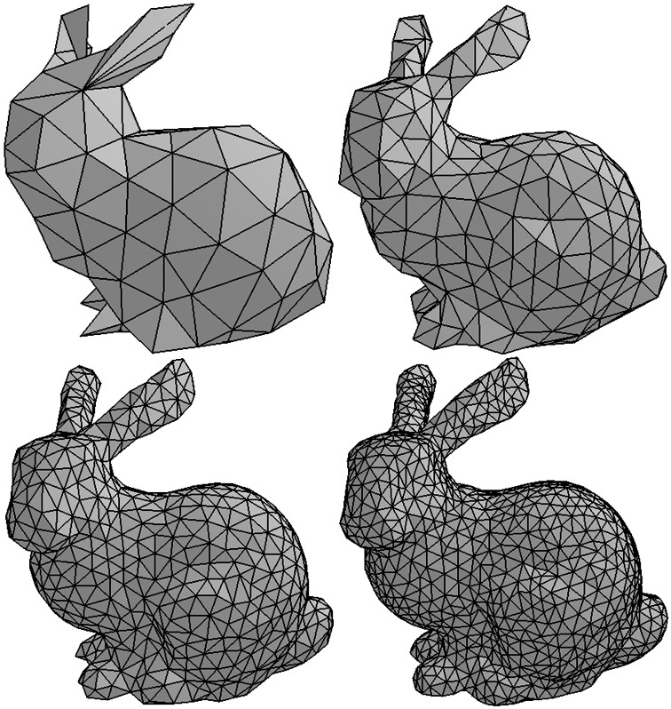

<!-- ---  
title: Creative Coding II
author: Angela Brennecke
affiliation: Film University Babelsberg KONRAD WOLF
date: Summer term 20
---   -->
**Creative Coding II - Summerterm 20**

Prof. Dr. Angela Brennecke | a.brennecke@filmuniversitaet.de | Film University Babelsberg *KONRAD WOLF*

Last Update: 2020/05/19

---

<!-- ---  
title: Creative Coding II
author: Angela Brennecke
affiliation: Film University Babelsberg KONRAD WOLF
date: Summer term 19
---   -->
**Creative Coding II - Summerterm 19**

Prof. Dr. Angela Brennecke | a.brennecke@filmuniversitaet.de | [Filmuniversitaet Babelsberg KONRAD WOLF](https://www.filmuniversitaet.de)

Last Update: 03.06.19


---

**Table of Contents**
- [Learning Objectives](#learning-objectives)
- [3D Objects and Meshes](#3d-objects-and-meshes)
  - [Vertex Buffer and Index Buffer](#vertex-buffer-and-index-buffer)
  - [Meshes in openFrameworks](#meshes-in-openframeworks)
  - [Meshes and Textures](#meshes-and-textures)
- [Shaders](#shaders)
  - [ofShader in openFrameworks](#ofshader-in-openframeworks)
    - [Shaders, Variables, GLSL Versions](#shaders-variables-glsl-versions)
    - [Important Variables Type Qualifiers](#important-variables-type-qualifiers)
- [Bibliography](#bibliography)
  - [Recap](#recap)
  - [Precap](#precap)


--- 

# Learning Objectives 

- Understanding 2D and 3D mesh representations
- Understanding the role of textures compared tp pixels
- Looking into shaders and how to use them with openFrameworks

--- 

# 3D Objects and Meshes

In computer graphics, 2D and 3D computer generated objects are usually represented as geometric objects described with the help of a data structure (or object) called a **mesh**. A 2D or 3D mesh is essentially a collection of vertex coordinates (vertices) that are arranged in a particular format (mostly triangular) in order to describe the surface of the object. Triangular meshes are commonly used to do so. Internally, they use a vertex and an index buffer.


## Vertex Buffer and Index Buffer

In order to represent a 2D or 3D object, mesh data structures (or mesh objects) take care of two things:

1. It stores 2D or 3D vertex coordinates in a vertex list called **vertex buffer**, i.e., (x,y) or (x, y, z), respectively. The vertices describe the geometric object.
2. It organizes the vertices with the help of an index list called **index buffer**. This buffer is used to arrange the vertices in a specific order, mostly in a triangular form, to describe the object's polygonal surface.

In the following illustration, a simple rectangular plane is described by four 3D vertices which are stored in a vertex buffer. The index buffer stores the arrangement of vertices reqiured to describe the triangulated mesh needed to represent the rectangle. Therefore, it stores the indices of the individual vertices. 


*Image source: https://www.e-reading-lib.com/chapter-amp.php/143437/58/andy-pike-directx-8-programming-tutorial.html*

As you can see, the first triangle is formed by the vertices 0, 1, 2 whereas the second triangle is formed by the vertices 3, 2, 1. 

The reason why two buffer lists are introduced to organize mesh representations is primarily twofold: First of all, every vertex (usually composed of 2 or 3 coordinate values) has to be stored only once. Second,  accessing and organizing indices, i.e., singular values, can be handled more efficient, as is illustrated in the following Figure:

  
 *Image source: http://www.opengl-tutorial.org/intermediate-tutorials/tutorial-9-vbo-indexing/*

Without indexing, you would have to store vertex values redundantly to describe the surfaces, for example.

A triangular mesh representation is the common form used to describe 3D objects. This is primarily due to the fact that the resolution can efficiently be increased as well as decreased with specific subdivision algorithms. [*REF*]
The subsequent illustration demonstrates a mesh of a 3D bunny object triangulated at different resolutions:


*Image source: http://www.cmap.polytechnique.fr/~peyre/images/test_remeshing.jpg*


**NOTE:** To learn more about meshes and triangulation, please refer to this link: https://www.scratchapixel.com/lessons/3d-basic-rendering/rendering-3d-scene-overview/rendering-3d-scene


## Meshes in openFrameworks

In openFrameworks, the mesh object **[ofMesh](https://openframeworks.cc/documentation/3d/ofMesh/)** supports the manual creation of 2D and 3D objects using mesh representations. ofMesh uses std::vector to implement the drawing of points and triangles, for example:

- `vector<glm::vec3> vertices          // 3D points`
- `vector<unsigned int> indices        // triangle connections` 

The former type uses the 3D vector type **glm::vec3** which comes from the OpenGL maths library [glm](https://glm.g-truc.net/0.9.9/index.html). openFrameworks provides a native vector type, ofVec3 and ofVec2 for 3D and 2D vectors. However, glm::vec2 or glm::vec3 should be used where possible due to reasons of efficiency as well as deprecation. 

In order to use an ofMesh object, you might do the following:

```cpp

    // Create an object
    ofMesh myMesh; 

    // Specify the drawing mode as well as you will use indices.
    myMesh.setMode(OF_PRIMITIVE_TRIANGLES);
    myMesh.enableIndices();

    // Define the vertices:
    glm::vec3 top(100.0, 50.0, 0.0);
    glm::vec3 left(50.0, 150.0, 0.0);
    glm::vec3 right(150.0, 150.0, 0.0);
    
    // Add the vertices to the mesh:
    myMesh.addVertex(top);
    myMesh.addVertex(left);
    myMesh.addVertex(right);
    
    // Specify the arrangment of the vertices:
    myMesh.addIndex(0);
    myMesh.addIndex(1);
    myMesh.addIndex(2);

    myMesh.draw();
```

What is important to mention at this point is that whenever you specify a mesh by adding vector information, you can also specify how the vector is going to be drawn, i.e., by specifying color values or - as we will see in the following section - texture values:

```cpp

    // Create an object
    ofMesh myMesh; 

    // Specify the drawing mode as well as you will use indices.
    myMesh.setMode(OF_PRIMITIVE_TRIANGLES);
    myMesh.enableColors();
    myMesh.enableIndices();

    // Define the vertices:
    glm::vec3 top(100.0, 50.0, 0.0);
    glm::vec3 left(50.0, 150.0, 0.0);
    glm::vec3 right(150.0, 150.0, 0.0);
    
    // Add the vertices to the mesh:
    myMesh.addVertex(top);
    myMesh.addVertex(left);
    myMesh.addVertex(right);

    // Specify color values per vertex:
    myMesh.addColor(ofFloatColor(1.0, 0.0, 0.0)); // Red
    myMesh.addColor(ofFloatColor(0.0, 1.0, 0.0)); // Green
    myMesh.addColor(ofFloatColor(0.0, 0.0, 1.0)); // Blue
    
    // Specify the arrangment of the vertices:
    myMesh.addIndex(0);
    myMesh.addIndex(1);
    myMesh.addIndex(2);

    myMesh.draw();
```

To learn more about how openFrameworks handles meshes and how they build on the underlying OpenGL library, please refer to the corresponding chapter on [meshes](https://openframeworks.cc/ofBook/chapters/openGL.html#meshes) in the ofBook and refer to the coding examples on meshes.

## Meshes and Textures

As we have seen previously, textures are image representations that are being processed on the GPU. In particular, textures are specific data types (or objects) used to texturize computer generated objects. Therefore, textures represent image data in the form of, i.e., pixel arrays together with certain functionality. This functionality takes care of calculating texture coordinates so that the pixel data can be mapped onto a 2D or 3D mesh representation. The texture coordinates have to correspond to the vertex coordinates representing the cg objects and pixel values between the coordinate values are usually interpolated.

The following Figure illustrates how a subsection of a texture image is specified in the form of texture coordinates which are then mapped onto a 3D pyramid object:


*Image source: http://www.c-jump.com/bcc/common/Talk3/OpenGL/Wk07_texture/Wk07_texture.html*

In contrast to this very simply example, in computer graphics and in particular in 3d modelling and game development, triangular meshes as well as specific texture images are used to generate highly complex computer generated objects as illustrated in the following two images:


*Image source: https://courses.cs.washington.edu/courses/cse458/19au/content/projects/project3b/*


*Image source: https://medium.com/@sdixon3/uv-mapping-texturing-and-shaders-rigging-and-animation-be9b4ddf0d48*

This section is also intended to make clear from the angle of GPU processing, what the difference between ofPixels and ofTexture is in openFrameworks and how both objects represent images in different application scenarios. 

Referring to the intial code example above, the specification of texture coordinates could be done as follows: 

```cpp
    // Create an object
    ofMesh myMesh; 
    myImage.load("lions2.png");
    //myTexture.allocate(myImage.getPixels());
    myTexture = myImage.getTexture();
    
    myMesh.setMode(OF_PRIMITIVE_TRIANGLES);
    myMesh.enableColors();
    myMesh.enableTextures();
    myMesh.enableIndices();
    
    glm::vec3 top(100.0, 50.0, 0.0);
    glm::vec3 left(50.0, 150.0, 0.0);
    glm::vec3 right(150.0, 150.0, 0.0);
    
    myMesh.addVertex(top);
    myMesh.addVertex(left);
    myMesh.addVertex(right);
    
    myMesh.addColor(ofFloatColor(1.0, 0.0, 0.0)); // Red top
    myMesh.addColor(ofFloatColor(0.0, 1.0, 0.0)); // Green left
    myMesh.addColor(ofFloatColor(0.0, 0.0, 1.0)); // Blue right

    myMesh.addTexCoord(myTexture.getCoordFromPercent(0.5,0));
    myMesh.addTexCoord(myTexture.getCoordFromPercent(0,1));
    myMesh.addTexCoord(myTexture.getCoordFromPercent(1,1));
    
    myMesh.addIndex(0);
    myMesh.addIndex(1);
    myMesh.addIndex(2);

    
    myTexture.bind();
    myMesh.draw();
    myTexture.unbind();
```

--- 

# Shaders

When the vertex data and all of the vertex specifications like color or texture are passed on to the rendering pipeline and the GPU, each vertex is processed, rasterized and finally written into the frame buffer. Shaders are small programs that can be executed on the GPU on a **per-vertex** and **per-pixel** basis to further enhance the rendering and image generation. In particular, there are two different shader types:

- **Vertex shader** to adjust and process the geometric vertex data and operate on one vertex at a time. 
  - Input: Vertex in world space
  - Output: Projected vertex position in clip space
- **Fragment shader** to adjust and process the rasterized fragment data and operate on one fragment at a time.
  - Input: Fragment
  - Output: Pixel color of the vertex

These are the programmable components of the graphics pipeline as illustrated below:


_Image source: https://www.ntu.edu.sg/home/ehchua/programming/opengl/cg_basicstheory.html_

As you can see, the vertex shader will be executed first, the fragment shader will be executed subsequently. 

1. vertex shader 
2. fragment shader


In particular, a **vertext shader** takes care of the following:

> "A vertex shader processes each vertex of the rendered object and changes its properties, such as position, normal, color, and some custom attributes. It can be used for geometric transformations of 3D objects." [Denis Perevalov, "Mastering openFrameworks", Chap. 8].

In contrast, a **fragment shader** is resonsible for finally calculating the final pixel color:

> "A fragment shader processes the color and depth of a pixel which is ready to be rendered to the screen or screen buffer. A fragment shader can be used for implementing postprocessing effects, and also for more complex image processing and generation." [Denis Perevalov, "Mastering openFrameworks", Chap. 8].

If you want to use either a vertex or a fragment shader or both in your program, you need to specify and enable both of them. openFrameworks simplifies this process with the ofShader object.

## ofShader in openFrameworks

openFrameworks provides the **ofShader object** that allows for setting up and loading vertex, (geometry) and fragment shaders. openFrameworks supports the OpenGL shading language GLSL. 

```cpp
// Declare a shader object.
ofShader shader;

// ... 

// Load the actual shader files. By default openFrameworks
// will search for the shader files in the bin/data folder.
shader.load("shaders/vert.glsl", "shaders/frag.glsl");

// ...

// Now enable the shader by calling the begin() and end()
// functions upon it. Every mesh that is put inside these
// function calls will be processed by the shaders.
shader.begin();    
myMesh.draw();
shader.end();

```

### Shaders, Variables, GLSL Versions

When working with shaders, it is important to understand that - due to their nature as being components of the rendering pipeline - specific variables like, e.g., **gl_Vertex**, **gl_Position**, **gl_ModelViewProjectionMatrix**, **gl_FragColor**, etc., are **built-in variables** provided by the underlying OpenGL library! These variables are used to access and change OpenGL-specific function states although their use as fixed built-in values has been removed with latest GLSL versions. Nonetheless, older versions are widely supported on many systems which is why you should know about them. The list of built-in variables used by GLSL and OpenGL can be found at 
- https://www.khronos.org/registry/OpenGL-Refpages/gl4/index.php

As mentioned above, the use of the built-in variables, however, changed with latest GLSL versions. The GLSL version you can use depends on the OpenGL version supported on your system and graphics card. 
Here, we will be working with GLSL 1.2 which will work on most machines. An overview of OpenGL and GLSL versions can be found at 
- https://www.khronos.org/opengl/wiki/Core_Language_(GLSL)

In order to find out about the OpenGL version supported on your platform, you can either run the openFrameworks example/gl/glInfoExample or start ProjectGenerator and select the OpenGL version you would like to use in the **Template** section. This will implicitly reveal which OpenGL will be supported on your system. 

### Important Variables Type Qualifiers

Basically, you will work with three different types of variable type qualifiers: 

- **Attributes**
  - These variable types can change once per vertex and correspond to the OpenGL's attribute settings
  - Examples: gl_Color, gl_Normal, gl_Vertex, gl_MultiTexCoord0, ...
- **Uniform**
  - These variables values are defined for the entire primitive and set through corresponding OpenGL calls
  - Examples: gl_ProjectionMatrix, gl_ModelViewMatrix, gl_NormalMatrix, ...
- **Varying**
  - These variables are exchanged between (or link) shaders
  - There are two sets of varying variables, one for the vertex and one for the fragment language
  - Examples: gl_Color, gl_TexCoord\[\], gl_FrontColor, ...
Variable type qualifiers can be used inside of your ofApp and be handed over to the shader programs for an execution on the GPU.

To learn more about shaders, please refer to the corresponding [chapter on shaders in the ofBook](https://openframeworks.cc/ofBook/chapters/shaders.html) and revisit the code examples. 

For more information on the latest list of shader types supported by OpenGL and latest GLSL version specifications, visit 
- https://www.khronos.org/registry/OpenGL/specs/gl/
- https://www.khronos.org/registry/OpenGL/index_gl.php

--- 

# Bibliography

## Recap 

Revise and Review

- [OpenGL & openFrameworks](https://openframeworks.cc/ofBook/chapters/openGL.html#meshes)
- [Meshes](https://openframeworks.cc/ofBook/chapters/openGL.html#meshes)
- [Shaders](https://openframeworks.cc/ofBook/chapters/shaders.html)
- [OpenGL GLSL Tutorial](https://www.opengl.org/sdk/docs/tutorials/TyphoonLabs/)

## Precap

Prepare and Preview

- We will look into shader programming next session and will move on with audio programming thereafter.
- [Sound](https://openframeworks.cc/ofBook/chapters/sound.html)