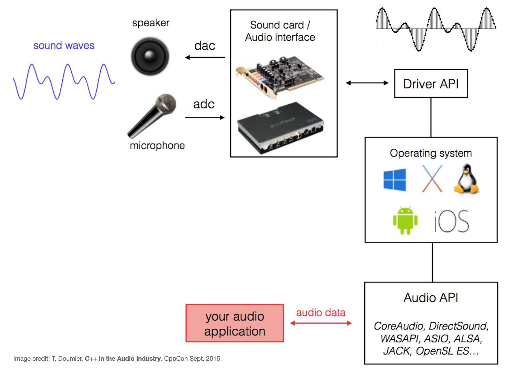
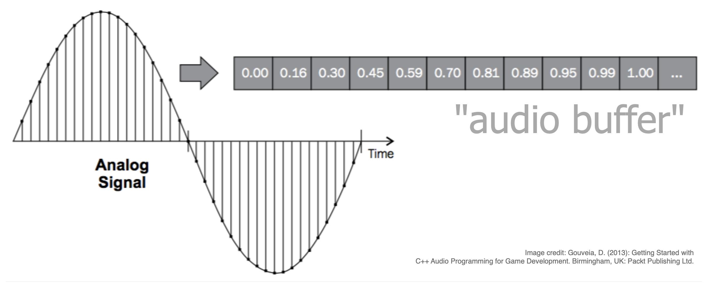
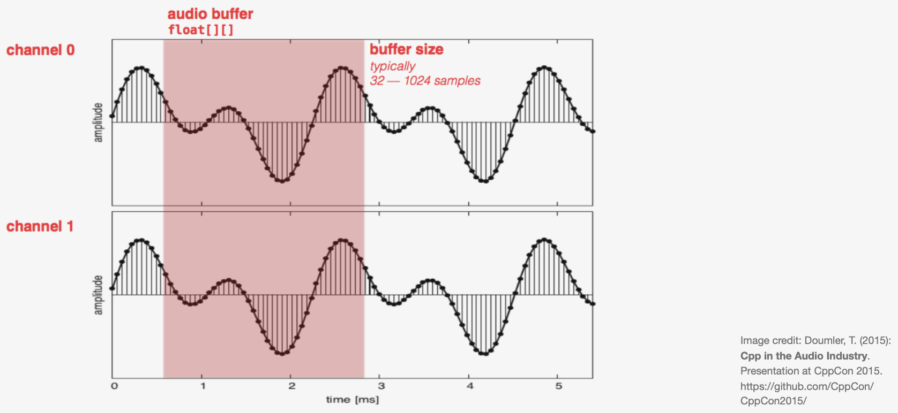

<!-- ---  
title: Creative Coding II
author: Angela Brennecke
affiliation: Film University Babelsberg KONRAD WOLF
date: Summer term 20
---   -->
**Creative Coding II - Summerterm 20**

Prof. Dr. Angela Brennecke | a.brennecke@filmuniversitaet.de | Film University Babelsberg *KONRAD WOLF*

Last Update: 

---

<!-- ---  
title: Creative Coding II
author: Angela Brennecke
affiliation: Film University Babelsberg KONRAD WOLF
date: Summer term 19
---   -->
**Creative Coding II - Summerterm 19**

Prof. Dr. Angela Brennecke | a.brennecke@filmuniversitaet.de | [Filmuniversitaet Babelsberg KONRAD WOLF](https://www.filmuniversitaet.de)

Last Update: 03.06.19


---

**Table of Contents**
- [Learning Objectives](#learning-objectives)
- [Overview](#overview)
- [Sound and Audio Processing](#sound-and-audio-processing)
  - [General Signal Flow](#general-signal-flow)
  - [Audio Buffers](#audio-buffers)
  - [Digital Sound Generation](#digital-sound-generation)
    - [Harmonic sounds](#harmonic-sounds)
    - [Inharmonic sounds](#inharmonic-sounds)
- [openFrameworks and Sound](#openframeworks-and-sound)
  - [ofSoundBuffer](#ofsoundbuffer)
  - [ofSoundStream](#ofsoundstream)
    - [Specifying ofSoundStream](#specifying-ofsoundstream)
    - [Advanced Implementation Details](#advanced-implementation-details)
  - [ofSoundBaseTypes](#ofsoundbasetypes)
- [openFrameworks Examples](#openframeworks-examples)
  - [Audio In Example](#audio-in-example)
  - [Audio Out Example](#audio-out-example)
- [Bibliography](#bibliography)
  - [Recap](#recap)
  - [Precap](#precap)


--- 

# Learning Objectives 

- Practical understanding of sound and audio programming theory
- Understanding how openFrameworks implements and integrates audio input and output
- Understanding how to work with audio buffers

--- 

# Overview

This session will be dedicated to sound generation with openFrameworks. To do so, we will follow three steps:

- First, we will recap briefly the theoretical concepts behind digital sound and audio processing. 
- Second, we will focus on understanding how openFrameworks implements sound and connects software with the underlying hardware (i.e., audio interface / soundcard). 
- Third we will explore two examples for generating audio and for capturing audio.


# Sound and Audio Processing

When you start working with digital sound and audio programming concepts, you will need to basically understand three aspects:

- How can sound and audio enter and leave a computer, i.e., how is the general signal flow defined?
- What kind of data (structure) is used to represent sound?
- How can you actually create this kind of data manually? 

## General Signal Flow

The general signal flow is described in the following illustration:



On the top left you see analog sound waves that float around the real world. These sound waves can be picked up by a microphone and be converted into digital sound waves (top right). The digital sound wave is a result of the sampling and quantisation processes executed by the analog-to-digital converter (ADC) of your computer's soundcard or audio interface. The resulting sample values are continuously written into an audio buffer and handed over to your application with the help of the audio interface's driver software, OS, and audio API that is being used by your application software. 

In the case of openFrameworks, for example, the audio API that is used to connect the ofApp with the underlying hardware specifics of the individual operating system is **rtAudio** (real-time audio). You'll find it inside of the libs/ folder of the openFrameworks SDK.

In an analog fashion to processing incoming audio, you might create and process audio data meant for playback. Therefore, you might continuously fill the audio buffer with manually generated audio data and hand over this data to the sound card / audio interface. There, the digital-to-analog converter would be executed and convert the digital information into analog (electrical voltage) information that can be played back by the speakers connected to your computer.

As you can see, the integration of audio devices and the generation and processing of audio data is conceptually very similar to the integration of graphics devices and the generation and processing of graphics data.

## Audio Buffers

An audio buffer simply contains floating point values that describe the sound wave's amplitude at a specific point in time as specified with the help of the index. The values range from -1.0 to 1.0 with 0.0 representing silence as illustrated in the following Figure:




## Digital Sound Generation

When we are talking about **digital sound generation** (or *synthesis*) in its simplest form, we often refer to creating and combining simple sine wave representations of sound. As you may remember, one sine can represent one (non-natural yet pure) tone. Mathematically, a sine wave can be described as follows:

```cpp
y = A * sin ( 2πf * t + ø)

A - Amplitude

f - frequency
2πf - the angular frequency (2*π*f)

t - time "index"

ø - phase
```

In order to create more complex or natural sounds, sine waves can be combined to create harmonic or inharmonic sound waves. 
When combining sine waves to create either form of a sound wave, take care of the Amplitude values! Any values >= +/- 1.0 will result in distorted cracks and pops.

### Harmonic sounds

To create harmonic sounds, first specify a sine wave at a **fundamental frequency**. Then create a complex sound by adding sine waves to this fundamental frequency that are defined by **integer multiples** of the fundamental frequency. The resulting sounds will be perceived as **harmonic**.


```cpp
fundamental = A * sin ( 2πf * t + ø)

complex = A * sin ( 2πf * t + ø)
          + A * sin ( 2 * 2πf * t + ø)
          + A * sin ( 3 * 2πf * t + ø)
          + A * sin ( 4 * 2πf * t + ø)
...
```

### Inharmonic sounds

To create inharmonic sounds, again specify a sine wave at a **fundamental frequency**. Then create a complex sound by adding sine waves to this fundamental frequency that are defined by **non-integer multiples** of the fundamental frequency. The resulting sounds will be perceived as **harmonic**.


```cpp
fundamental = A * sin ( 2πf * t + ø)

complex = A * sin ( 2πf * t + ø)
          + A * sin ( 2.453 * 2πf * t + ø)
          + A * sin ( 1.343 * 2πf * t + ø)
          + A * sin ( 4.56342 * 2πf * t + ø)
...
```

This way of generating complex synthetic sounds is fundamental of any further synthesis process. 


# openFrameworks and Sound

The openFrameworks SDK has dedicated components for audio and sound processing located in the “sound” folder of the SDK. Most important concepts to understand how openFrameworks handles sound and audio processing are defined in these three classes:

- ofSoundBuffer
- ofSoundStream
- ofSoundBaseTypes

## ofSoundBuffer

The **ofSoundBuffer** class is the main class that defines an audio buffer object including parameters like buffer data, channels, frames, sampleRate, etc. and functionality like getSample(), fillWithTone(...), etc.
It is used to hold the real audio data which is implemented as an array of interleaved floating point samples. In order to process the audio data correctly, it is of utmost importance to understand, set and evaluate the following two parameteres:

- channel
- frame

The channel describes the "spatial" setup of the audio buffer, i.e., how the audio data will be mapped to the speakers. For example, 1 channel means "mono" playback, 2 channels mean "stereo" playback, 6 channels mean "surround sound" or 5.1 playback with 3 channels in the front, two channels in the back (all of them in the range of 20-20k Hz) and one low frequency (in the range of 20-120Hz) channel, etc. An example of a mono channel array would be 

- Mono channel array: [L, L, L, L, L, L, L, L]
- Stereo channel array: [L,R, L,R, L,R, L,R, L,R, L,R, L,R, L,R] 

The frame describes the set of related audio samples, i.e., in the example of the mono channel array, we have 8 frames, 1 channels and also 8 individual samples. In contrast, in the stereo case, we have again 8 frames yet 2 channels and accordingly 8 (frames) x 2 (channels) = 16 samples. 

The following Figure illustrates the concept of channel and frame that are applied to audio buffer setup and processing:



As you can see, an audio buffer always only contains a small portion of (continuously processed) audio data that it hands over from or to the sound card to or from the application. The size of the audio buffer, the **buffer size**, often depends on the CPU power and needs to be chosen carefully in order to avoid latency issues, dropouts our crackles. Usually, the buffer size varies between 512 to 1024 samples.

## ofSoundStream

The **ofSoundStream** class defines a sound stream object which takes care of how the overall **stream of sound** that is entering the ofApp (i.e., for recording) and/or is leaving the ofApp (i.e., for play back) can be processed. Therefore, the sound stream object
implements how openFrameworks connects with the audio input and output devices, i.e., the microphone and speaker devices that are connected to the computer via audio interface or soundcard. 

As you will remember from the beginning of the lecture, hardware devices come with a corresponding driver software which serves as an application programming interface (API). The API can then be used to drive (or access or simply use) the hardware. This is also true in the case of audio. Hence the ofSoundStream class establishes a connection between the openFrameworks application and the (harwdware) driver software (i.e., the API of the soundcard driver) which in turn takes care of sending incoming audio to the ofApp or sending outgoing audio to the speakers for playback. 

### Specifying ofSoundStream

You as an application developer will hardly use the ofSoundStream object directly though. Instead, you will specify how the sound stream should be set up, what buffer size you will process, how many audio channels you want to use, etc. In order to specify the sound stream, you will use the following class and functions:

- Add an **ofSoundStreamSettings** object to the ofApp and set its parameters.
- Call the static function **ofSoundStreamSetup( ofSoundStreamSettings& )** to initialize the sound stream.
- Define the callback methods **audioIn (...)** and  **audioOut(...)** in your ofApp.

The latter are defined in ofBaseApp and are automatically called whenever the system receives sound from the soundcard or before the app sends sound out to the soundcard. Both methods require the function ofSoundStreamSetup( ofSoundStreamSettings& ) to be called in advance.

### Advanced Implementation Details

openFrameworks itself does not handle the connection to a specific driver API however. Instead, it makes use of an external audio library called RTAudio library. RTAudio library is developed at McGill University and takes care of easily providing access to various different audio interface driver API's. For example, RTAudio library is an API that can handle OSX Core Audio, ALSA, Asio4all, and many more. Hence, calling the ofSoundStreamSetup function actually starts the RTAudio library and triggers the setup of a sound stream.

To be more precise, openFrameworks provides an ofRTAudioSoundStream class which derives from ofSoundStream and implements the connection to the RTAudio library. All applications or "clients" that want to make use of RTAudio must create a function called **RtAudioCallback**. This function is being called by RTAudio and allows for reading and writing data from and to the audio stream. When the underlying audio system is ready for new input, this function is being invoked. Check out how openFrameworks implements and uses this function.

Finally, during compilation the compiler defines the sound stream API to be used (RTAudio for desktop, Android, iOS, emscripten, .. ) as defined in utils/ofConstants.h.

- See also RTAudio.h 
- See also https://openframeworks.cc/documentation/sound/ofSoundStream/


## ofSoundBaseTypes

The ofSoundBaseTypes header file provides a collection of different objects that can be used to actually set up and integrate audio processing into an ofApp. The classes and the way they are implemented require an advanced understanding of class design (for example, inheritance used to describe class hierarchies) and use several advanced techniques like C++ templates (used for generic programming). 

> NOTE: As a consequence, you may not understand all of the imeplementation details. Nevertheless I recommend you review the classes in the sdk and try to practice developing an intuition for the design aspects that come along with these classes. 

The following classes are part of the ofSoundBaseTypes:

- ofBaseSoundInput & ofBaseSoundOutput
  - Parent classes of ofBaseApp that declare audioIn and audioOut functions.
- ofSoundDevice
  - Sound device interface APIs.
- ofSoundStreamSettings
  - Connects an ofApp with an audio device through a callback function.
  - Specifies the sound stream and setOutListener and setInListeners.
- ofBaseSoundStream
  - The real sound stream base class.
  - Sends sound buffer data through ofSoundStreamSettings callback to an ofApp.
- ofBaseSoundPlayer 
  - Supports simple playback of audio files.


# openFrameworks Examples

Here, the following two screencast will show you how openFrameworks supports the processing of incoming audio as well as the generation and playing back of manually generated audio.

## Audio In Example

*Attention: The videos may take a couple of minutes to load.*

[](https://owncloud.gwdg.de/index.php/s/0ym6pV8gyjfMojz)


## Audio Out Example

*Attention: The videos may take a couple of minutes to load.*

[](https://owncloud.gwdg.de/index.php/s/GDGkw2DtMdK3ota)


--- 

# Bibliography

## Recap 

Revise and Review

- [openFrameworks and Sound](https://openframeworks.cc/ofBook/chapters/sound.html)

## Precap

Prepare and Preview

- [OOP Inheritance](https://openframeworks.cc/ofBook/chapters/OOPs!.html)
