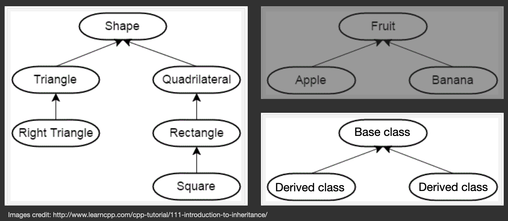

<!-- ---  
title: Creative Coding II
author: Angela Brennecke
affiliation: Film University Babelsberg KONRAD WOLF
date: Summer term 20
---   -->
**Creative Coding II - Summerterm 20**

Prof. Dr. Angela Brennecke | a.brennecke@filmuniversitaet.de | Film University Babelsberg *KONRAD WOLF*

Last Update: 05/31/20

---

**Table of Contents**
- [Learning Objectives](#learning-objectives)
- [Relationships in Object-Oriented Programming](#relationships-in-object-oriented-programming)
- [Inheritance](#inheritance)
    - [Inheritance and Object Construction](#inheritance-and-object-construction)
    - [Inheritance and Access Levels](#inheritance-and-access-levels)
    - [Polymorphism](#polymorphism)
    - [Overriding Functions](#overriding-functions)
    - [Virtual Functions](#virtual-functions)
- [Final Project](#final-project)
  - [Bibliography](#bibliography)
  - [Recap](#recap)


--- 

# Learning Objectives 

- Understanding relationships in object-oriented programming
- Understanding inheritance -- hierarchical object-object relationship
- Final Project

--- 

# Relationships in Object-Oriented Programming 

A stable class interface that targets data encapsulation is usually determined by two aspects:
- A set of public access and manipulation functions that are independent of the underlying data types and structures
- A set of private data member variables and functions that define and manage the underlying data types and structures

Often times, the data member variables of a class are objects of user-defined class (types) themselves and thus object and class design often is determined by object-object relationships -- how do the objects relate to each other?

For example, the ofApp class is the main application object that gets created first and this object then initializes several objects that it contains in the form of member variables. The object-object relationship that is expressed here is referred to as **has-a** relationship. For instace, ofApp object **has-a** CGObjectManager object, etc.

In object-oriented programming other relation types exist, for instance,
- **Composition** or aggregation: *A body **has-a** heart*
- Association: *A computer **uses-a** mouse*
- Dependency: *A flower **depends-on** a bee for pollination*
- **Inheritance**: *A baseball **is-a** ball*

Composition is fundemantal when starting to program object-oriented; inheritance is the second most important relationship that you should be aware of. Association and dependency are specifics that we will not look into now.

# Inheritance

Inheritance models the **is-a** relationship between objects as illustrated in the following Diagram:



As you can see on the left, the shape class serves as base class from which more specific classes are inherited, all of them **being a** certain kind of shape. The same is true for the right side: The fruit class specifies the general features of a fruit, whatever this might be, and has two specific fruits inherit these features, i.e., apple and banana. In C++, inheritance is expressed by the use of the ":" following the base class that is being derived from, as illustrated below:

```cpp

// base class fruit
class fruit
{
public:
    // constructors
    fruit();                        // default
    fruit(std::string theName);     // user-defined

protected:
    void printName();
    void printColor();
    
private:

    void overseas();
    std::string myName;
};


// Derived class apple
class apple : public fruit
{
    
public:

    apple(); // default constructor
    
private:

};


// Derived class banana
class banana : public fruit
{
public:
    
    banana(); // default constructor
    
private:
    // no private declarations yet
};
```

The derived classes inherit all functionality from the base class. However, the derived class can only access functionality specifed under **public** and **protected**, see the following code example:

```cpp
#include "fruit.h"
#include "banana.h"
#include "apple.h"

int main()
{
    // Instantiate 4 objects of the same object family
    fruit aFruit;                       // default constructor
    fruit anotherFruit{"anotherFruit"}; // user-defined constructor
    apple anApple;
    banana aBanana;
    
    // Call class functions upon the objects
    aFruit.printName();
    anotherFruit.printName();
    aFruit.overseas();
    
    // Since apple and banana are children of fruit, they can access and use 
    // the same functionality - as long as it is defined under public or protected.
    anApple.printName();    // the derived classes inherit the
    aBanana.printName();    // base class function printName()
    aBanana.overseas();     // Compile-time error! Private access level

    return 0;
}
```

While **object composition** creates new objects *by combining and connecting other objects*, **inheritance** creates new objects by directly **acquiring attributes and functionality of other objects and extending or specializing** them.

As such, inheritance typically models hierarchical relationships that **show a progression from general to specific**. In C++ we speak of a 
- **base class**
- **derived class**
  
The derived class inherits all attributes and functionality of its base class — without access to private base members. An important aspect of inheritance is the sequence of construction: 

### Inheritance and Object Construction

- **The base class constructor will always be called prior to the derived class constructor!**

If not called explicitly by the derived class, the default constructor of the base class will be called. This can result in unexpected behavior which is why you should always explicitly call the base class constructor. For a detailed explanation, see this article:

- https://www.learncpp.com/cpp-tutorial/114-constructors-and-initialization-of-derived-classes/

### Inheritance and Access Levels

Derived classes can fully access all public member functions and data of their base classes. To further specify object hierarchies, the protected access level exists. Functionality defined under protected access can be accessed only from with the class itself and its children (see the fruit example above).

### Polymorphism 

Polymorphism describes the capability to handle all objects of one class family intuitively by using a pointer of type base class: 

```cpp
#include "fruit.h"
#include "apple.h"
#include "banana.h"

int main()
{
    fruit aFruit;
    apple anApple;
    banana aBanana;

    fruit* aFruit = &anApple;
    aFruit->printName();

    aFruit = &banana;
    aFruit->printName();
    
    return 0;
}
```

This way, object families can be handled more easily. Pointers serve as a tool to **dynamically resolve** hierarchical object-object relationships. 


### Overriding Functions

Derived classes can also override functions that were specified in the base class, for example:

```cpp
// Derived class apple
class apple : public fruit
{
    
public:

    apple(); // default constructor
    
protected: 
    void printColor(); // in the cpp file, specify a specific function of class apple    

private:

};
```

In the main function, the pointer of type base class tries to resolve the function call.
```cpp
#include "fruit.h"
#include "apple.h"
#include "banana.h"

int main()
{
    fruit aFruit;
    apple anApple;

    fruit* aFruit = &anApple;
    aFruit->printName();
    aFruit->printColor();   // ???  Output error ???
    
    return 0;
}
```

When the derived class overrides a base class function like in this example, the pointer of type base class cannot resolve the specific function call that belongs to the derived class. With the help of specifying a function as **virtual** the relationship can be resolved.

### Virtual Functions

By declaring a base class function as virtual, every function call will be resolved to the actual object the pointer of type base class is pointing to, see the following code example:

```cpp

// Derived class apple
class fruit
{
    
// ... 
    
protected: 
    // Specify the function to be virtual so that it can be resolved to the actual object
    virtual void printColor(); 
// ...
};
```

```cpp
// Derived class apple
class apple : public fruit
{
    
// ...
    
protected: 

    // Nothing needs to be changed in the derived class
    void printColor(); 
};
```

```cpp
#include "fruit.h"
#include "apple.h"
#include "banana.h"

int main()
{
    fruit aFruit;
    apple anApple;

    fruit* aFruit = &anApple;
    aFruit->printName();
    aFruit->printColor();   // Output as specified in apple, i.e., "my color is red"
    
    return 0;
}
```


The advantage is the you can handle all objects of a class hierarchy through their base type without losing the specific functionality of the derived classes. This is particularly useful when you have to manage several different objects. Hence, inheritance and polymorphism are very powerful concepts when designing classes and object relationships.

To dive deeper into the concepts of polymorphism and how they can enhance the management of objects in your code refer to
- http://www.cplusplus.com/doc/tutorial/polymorphism/


---

# Final Project

* The final exercise will be a programming exercise of an openFrameworks application. The type of application can be chosen individually. However, the application must include/address:
  * Object-oriented design
  * At least two different topics from the course
  * An artistic idea that can be freely chosen 

--- 

## Bibliography

## Recap 

Revise and Review

- [OOP Inheritance](https://openframeworks.cc/ofBook/chapters/OOPs!.html)
- [Polymorphism Tutorial](http://www.cplusplus.com/doc/tutorial/polymorphism/)

